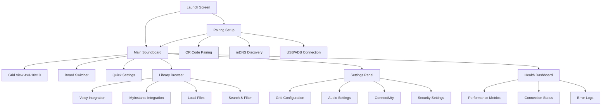
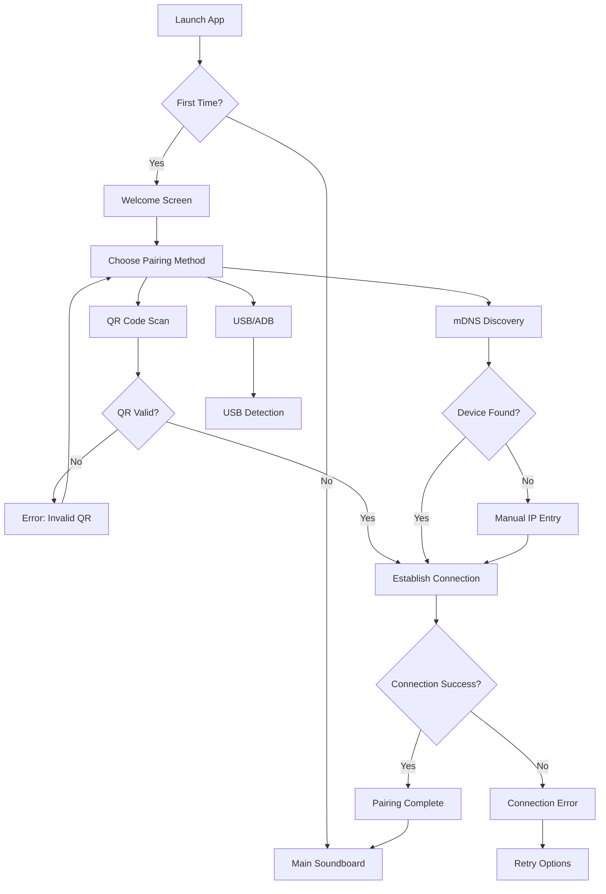
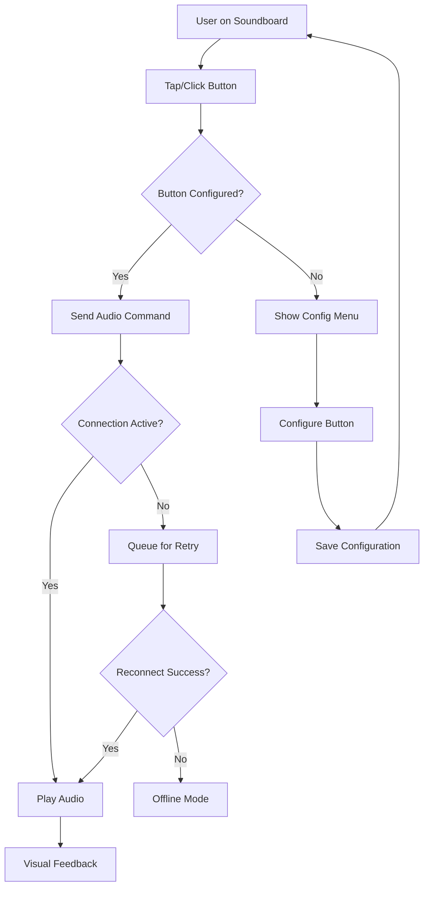
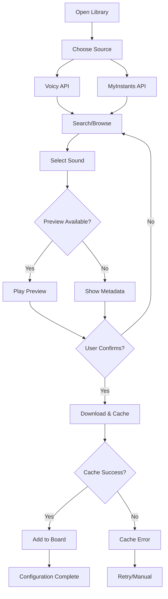

# Soundboard App UI/UX Specification

## Introduction

This document defines the user experience goals, information architecture, user flows, and visual design specifications for Soundboard App's user interface. It serves as the foundation for visual design and frontend development, ensuring a cohesive and user-centered experience.

---

*Document Status: In Progress*  
*Created: $(date)*  
*Template Version: 2.0*

## Change Log

| Date | Version | Description | Author |
|------|---------|-------------|--------|
| $(date) | 1.0 | Initial document creation | Sally (UX Expert) |

---

## Overall UX Goals & Principles

### Initial Analysis & Recommendations

Based on the existing PRD, I've identified three key user personas and drafted initial UX goals and design principles for the Stream Deck-inspired Soundboard App:

**Target User Personas:**
- **Streamer Sam:** Live streamer who needs seamless sound triggers during streams
- **AV Engineer Alex:** Enterprise AV technician requiring reliable event cue management with monitoring
- **Podcaster Pat:** Podcast host needing smooth jingle/stinger insertion during recording

**Proposed Usability Goals:**
- **Immediate Response:** Audio triggers must respond in <10ms with visual feedback in <50ms
- **Effortless Learning:** New users can set up their first soundboard and play sounds within 2 minutes
- **Professional Reliability:** 99.9% uptime with resilient network handling for live production environments
- **Cross-Platform Consistency:** Familiar interface patterns across mobile and desktop platforms

**Proposed Design Principles:**
1. **Instant Feedback First** - Every interaction provides immediate visual and audio confirmation
2. **Professional Simplicity** - Clean, focused interface that doesn't distract from live performance
3. **Adaptive Intelligence** - Interface adapts to device capabilities and user context
4. **Bulletproof Reliability** - Graceful degradation and clear error communication
5. **Accessible by Design** - Full keyboard navigation and screen reader support from day one

### Detailed Rationale

**Trade-offs Made:**
- Prioritized performance metrics over feature richness to meet professional streaming requirements
- Chose consistency over platform-specific optimizations to reduce development complexity
- Selected 5 core principles rather than extensive list to maintain focus

**Key Assumptions:**
- Users prioritize reliability and speed over advanced customization
- Cross-platform consistency is more valuable than native platform conventions
- Professional users will accept learning curve for powerful features

**Critical Decisions Requiring Validation:**
- Whether 2-minute onboarding goal is realistic given technical complexity
- If enterprise users need additional monitoring/diagnostic UI elements
- Whether mobile and desktop should share identical interaction patterns

---

**🎯 ELICITATION REQUIRED - Please select an option:**

**1.** Proceed to next section
**2.** Stakeholder Interview - Conduct structured interviews with target users
**3.** Persona Validation Workshop - Validate and refine user personas with team
**4.** Competitive Analysis - Analyze similar tools (Stream Deck software, OBS, etc.)
**5.** User Journey Mapping - Map detailed user journeys for each persona
**6.** Assumption Testing - Design experiments to validate key assumptions
**7.** Heuristic Evaluation - Evaluate current design against usability principles
**8.** Card Sorting - Organize features and functions with user input
**9.** Prototype Testing - Test low-fidelity concepts with target users

**✅ User Selection: 1 - Proceed to next section**

---

## Information Architecture (IA)

### Site Map / Screen Inventory

Based on the PRD requirements, I've mapped out the core screens and navigation structure for the Soundboard App:

### Navigation Structure

**Primary Navigation:**
- **Tab-based navigation** for mobile (Soundboard, Library, Settings)
- **Sidebar navigation** for desktop with collapsible panels
- **Floating Action Button** for quick board switching

**Secondary Navigation:**
- **Contextual menus** on long-press/right-click for button configuration
- **Swipe gestures** for board switching on mobile
- **Dropdown selectors** for grid size and theme selection

**Breadcrumb Strategy:**
- **Minimal breadcrumbs** in Settings (Settings > Audio > Advanced)
- **State indicators** showing current board name and connection status
- **Back button behavior** follows platform conventions

### Detailed Rationale

**Trade-offs Made:**
- Chose tab navigation over hamburger menu for faster access to core functions
- Prioritized board switching speed over deep navigation hierarchy
- Selected floating action button despite potential accessibility concerns (will provide keyboard alternative)

**Key Assumptions:**
- Users will primarily stay within the main soundboard view during live use
- Library browsing is a setup activity, not real-time performance need
- Health dashboard is primarily for troubleshooting, not constant monitoring

**Critical Decisions Requiring Validation:**
- Whether board switching should be gesture-based or button-based for reliability
- If health dashboard should be always-visible or on-demand
- Whether settings should be modal or dedicated screen

---

**🎯 ELICITATION REQUIRED - Please select an option:**

**1.** Proceed to next section
**2.** Stakeholder Interview - Validate navigation preferences with target users
**3.** Persona Validation Workshop - Test IA against each user persona's workflow
**4.** Competitive Analysis - Study Stream Deck software and similar tool navigation
**5.** User Journey Mapping - Map navigation paths for critical user tasks
**6.** Assumption Testing - Test navigation efficiency with target users
**7.** Heuristic Evaluation - Evaluate IA against usability principles
**8.** Card Sorting - Organize features and screens with user input
**9.** Prototype Testing - Test navigation flow with interactive prototype

**✅ User Selection: 1 - Proceed to next section**

---

## User Flows

### Critical User Task Flows

Based on the PRD, I've identified and mapped the most critical user flows for the Soundboard App:

### Flow 1: Initial Setup & Pairing

**User Goal:** Connect mobile device to desktop for the first time

**Entry Points:** App launch (first time), Settings > Connectivity

**Success Criteria:** Successful pairing with <2 minute setup time

#### Flow Diagram

**Edge Cases & Error Handling:**
- Network connectivity issues during pairing
- Invalid QR codes or corrupted data
- USB/ADB permission denied
- Desktop app not running or firewall blocking
- Multiple devices discovered (disambiguation)

**Notes:** Critical that error messages provide clear next steps, not just failure notification

### Flow 2: Live Sound Triggering

**User Goal:** Trigger sounds during live performance with minimal latency

**Entry Points:** Main soundboard screen

**Success Criteria:** <10ms audio response, clear visual feedback

#### Flow Diagram

**Edge Cases & Error Handling:**
- Network interruption during performance
- Audio file corruption or missing
- Desktop audio system busy/unavailable
- Button pressed multiple times rapidly
- Memory/CPU overload during intensive use

**Notes:** Must prioritize audio delivery over UI updates during performance

### Flow 3: Library Integration & Caching

**User Goal:** Browse and add sounds from online libraries (Voicy/MyInstants)

**Entry Points:** Library tab, button configuration menu

**Success Criteria:** Find and cache sounds within 30 seconds

#### Flow Diagram

**Edge Cases & Error Handling:**
- API rate limiting or service unavailable
- Large file downloads on slow connections
- Cache storage full (500MB limit)
- Corrupted downloads
- Copyright/licensing restrictions

**Notes:** Need clear progress indicators for downloads and cache management

### Detailed Rationale

**Trade-offs Made:**
- Prioritized connection reliability over setup speed in pairing flow
- Chose immediate audio feedback over perfect error handling during performance
- Selected progressive download over batch caching for library integration

**Key Assumptions:**
- Users will tolerate longer setup time for reliable performance
- Visual feedback can substitute for audio feedback during connection issues
- Library browsing happens during preparation, not live performance

**Critical Decisions Requiring Validation:**
- Whether offline mode should cache entire boards or individual sounds
- If pairing should auto-retry or require manual intervention
- Whether library preview should be mandatory or optional

---

**🎯 ELICITATION REQUIRED - Please select an option:**

**1.** Proceed to next section
**2.** Stakeholder Interview - Validate flows with actual user scenarios
**3.** Persona Validation Workshop - Test flows against each persona's needs
**4.** Competitive Analysis - Study how similar apps handle these flows
**5.** User Journey Mapping - Create detailed journey maps for each flow
**6.** Assumption Testing - Test flow assumptions with target users
**7.** Heuristic Evaluation - Evaluate flows against usability principles
**8.** Card Sorting - Organize flow steps and decision points
**9.** Prototype Testing - Test flows with interactive prototypes

**Select 1-9 or just type your question/feedback:**