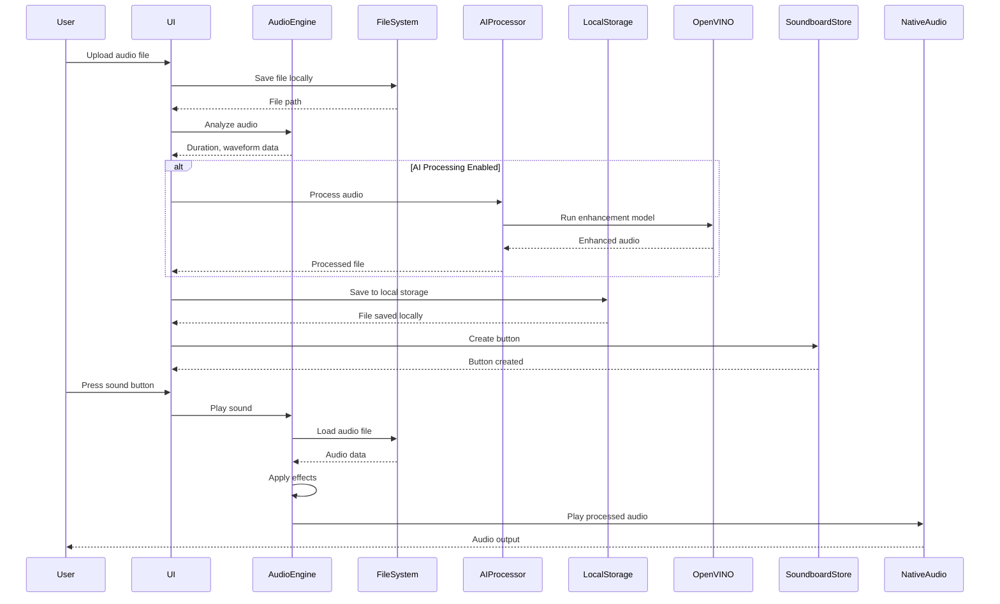
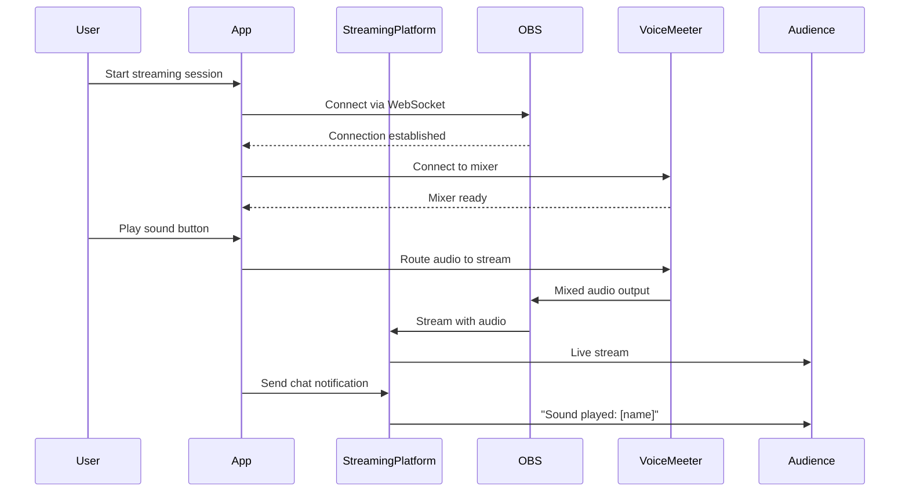
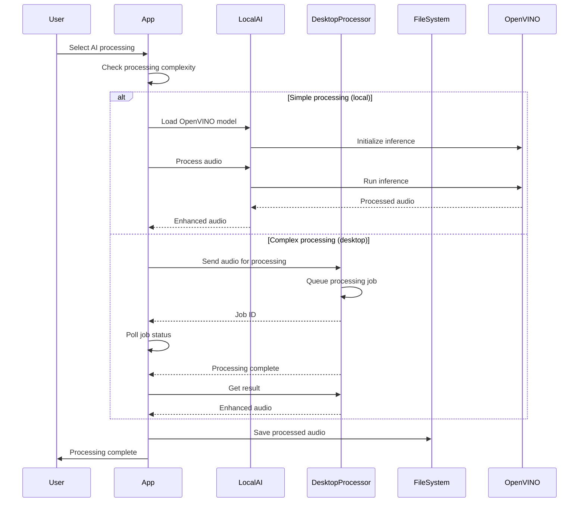
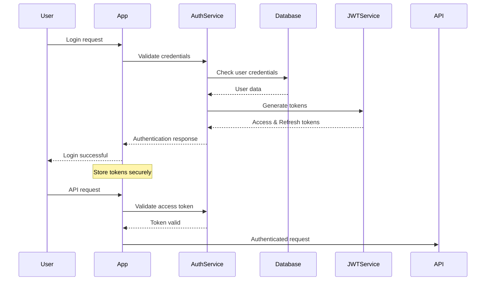
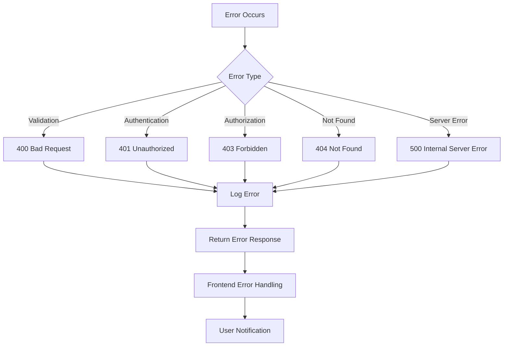

# Fullstack Architecture Document
## Android Soundboard App

### Document Information
- **Version:** 1.0
- **Date:** 2024-12-19
- **Author:** Architect
- **Status:** Draft

---

## Introduction

### Project Overview
The Android Soundboard App is a sophisticated cross-platform audio application built with React Native, featuring advanced AI-powered audio processing, real-time streaming capabilities, and comprehensive third-party integrations. The application serves content creators, streamers, podcasters, and audio enthusiasts with professional-grade audio tools.

### Architecture Goals
- **Cross-Platform Compatibility:** Single codebase for Android and iOS
- **Low-Latency Audio:** Real-time audio processing with <50ms latency
- **AI Integration:** OpenVINO-powered audio enhancement and processing
- **Scalable Architecture:** Support for enterprise features and local desktop server integration
- **Offline-First:** Core functionality available without internet connection
- **Professional Integration:** VoiceMeeter, OBS Studio, and streaming platform support

### Key Constraints
- React Native framework requirement
- OpenVINO AI integration for audio processing
- Real-time audio performance requirements
- Cross-platform compatibility (Android/iOS)
- Offline functionality for core features
- Enterprise-grade security and reliability

---

## High-Level Architecture

### Technical Summary
The application follows a hybrid architecture combining:
- **Frontend:** React Native with TypeScript for cross-platform mobile development
- **Audio Engine:** Native modules with React Native Audio API for low-latency processing
- **AI Processing:** OpenVINO runtime integrated via native bridges
- **State Management:** Zustand for lightweight, performant state management
- **Backend Services:** Local Node.js/Express server running as headless desktop service
- **Database:** SQLite for local storage, mobile app data synchronization
- **Real-time Communication:** Socket.io + Electron IPC for mobile-desktop communication

### Platform and Infrastructure Choice

**Mobile Platform:**
- **Framework:** React Native 0.73+
- **Language:** TypeScript for type safety and developer experience
- **Build System:** Metro bundler with custom native module integration
- **Deployment:** Google Play Store (Android), Apple App Store (iOS)

**Desktop Server Infrastructure:**
- **Runtime:** Node.js 18+ with Express.js framework (headless)
- **Desktop Framework:** Electron (headless mode) for system tray integration
- **Database:** SQLite for local file-based storage
- **Audio Output:** Web Audio API + Node.js audio libraries (node-speaker, PvSpeaker)
- **Service Management:** PM2 for process management and auto-restart
- **System Integration:** Electron Tray for Windows/macOS taskbar presence

**AI/ML Infrastructure:**
- **Framework:** OpenVINO 2023.3+ for cross-platform AI inference
- **Models:** Custom audio processing models (noise reduction, enhancement)
- **Deployment:** Embedded models in mobile app and desktop server

### Repository Structure
```
android-soundboard-app/
├── .github/                    # CI/CD workflows
│   └── workflows/
│       ├── ci.yaml
│       ├── android-build.yaml
│       └── ios-build.yaml
├── apps/
│   └── mobile/                 # React Native application
│       ├── src/
│       │   ├── components/     # Reusable UI components
│       │   ├── screens/        # Screen components
│       │   ├── navigation/     # Navigation configuration
│       │   ├── services/       # API and native module services
│       │   ├── stores/         # Zustand state stores
│       │   ├── hooks/          # Custom React hooks
│       │   ├── utils/          # Utility functions
│       │   ├── types/          # TypeScript type definitions
│       │   └── constants/      # App constants
│       ├── android/            # Android-specific code
│       │   ├── app/src/main/java/
│       │   │   └── com/soundboard/
│       │   │       ├── audio/  # Native audio modules
│       │   │       ├── ai/     # OpenVINO integration
│       │   │       └── voicemeeter/ # VoiceMeeter bridge
│       │   └── build.gradle
│       ├── ios/                # iOS-specific code
│       │   ├── SoundboardApp/
│       │   │   ├── Audio/      # Native audio modules
│       │   │   ├── AI/         # OpenVINO integration
│       │   │   └── VoiceMeeter/ # VoiceMeeter bridge
│       │   └── Podfile
│       ├── __tests__/          # Test files
│       └── package.json
├── packages/
│   ├── shared/                 # Shared types and utilities
│   │   ├── src/
│   │   │   ├── types/          # Common TypeScript interfaces
│   │   │   ├── constants/      # Shared constants
│   │   │   ├── utils/          # Shared utility functions
│   │   │   └── api/            # API client and types
│   │   └── package.json
│   ├── audio-engine/           # Audio processing core
│   │   ├── src/
│   │   │   ├── processors/     # Audio effect processors
│   │   │   ├── streaming/      # Real-time streaming
│   │   │   ├── ai/             # AI audio processing
│   │   │   └── formats/        # Audio format handlers
│   │   └── package.json
│   └── config/                 # Shared configuration
│       ├── eslint/
│       ├── typescript/
│       └── jest/
├── desktop-server/             # Local desktop server
│   ├── src/
│   │   ├── routes/             # API route handlers
│   │   ├── services/           # Business logic services
│   │   ├── models/             # Database models (SQLite)
│   │   ├── middleware/         # Express middleware
│   │   ├── audio/              # Audio engine and output
│   │   ├── tray/               # System tray integration
│   │   ├── utils/              # Server utilities
│   │   ├── main.ts             # Electron main process
│   │   └── server.ts           # Express server entry
│   ├── tests/                  # Server tests
│   ├── build/                  # Build configurations
│   │   ├── electron-builder.json
│   │   ├── windows.nsis
│   │   └── macos.dmg
│   └── package.json
├── deployment/                 # Desktop deployment
│   ├── scripts/                # Build and packaging scripts
│   ├── installers/             # Platform-specific installers
│   └── certificates/           # Code signing certificates
├── docs/                       # Documentation
│   ├── prd_rewrite_v0.4.md
│   ├── ui-brainstorming-session.md
│   └── fullstack-architecture.md
├── .env.example                # Environment template
├── package.json                # Root package.json
├── yarn.lock                   # Dependency lock file
└── README.md
```

---

## Architectural Patterns

### Primary Patterns
1. **Layered Architecture:** Clear separation between UI, business logic, and data layers
2. **Repository Pattern:** Abstracted data access for both local and remote data sources
3. **Observer Pattern:** Event-driven audio processing and real-time updates
4. **Strategy Pattern:** Pluggable audio processors and AI models
5. **Bridge Pattern:** Native module integration for platform-specific functionality
6. **Command Pattern:** Audio operations and undo/redo functionality

### Cross-Cutting Concerns
- **Error Handling:** Centralized error management with user-friendly messaging
- **Logging:** Structured logging for debugging and analytics
- **Security:** End-to-end encryption for sensitive data and secure API communication
- **Performance:** Lazy loading, memoization, and efficient audio buffer management
- **Accessibility:** WCAG 2.1 AA compliance for inclusive design

---

## Tech Stack Definition

### Frontend Stack
- **Framework:** React Native 0.73+
- **Language:** TypeScript 5.0+
- **State Management:** Zustand 4.4+
- **Navigation:** React Navigation 6.x
- **UI Components:** React Native Elements + Custom components
- **Audio Processing:** React Native Audio API + Native modules
- **AI Integration:** OpenVINO React Native bridge
- **Testing:** Jest + React Native Testing Library
- **Code Quality:** ESLint + Prettier + Husky

### Backend Stack (Local Desktop Server)
- **Runtime:** Node.js 18+ LTS
- **Framework:** Express.js 4.18+ (headless local server)
- **Language:** TypeScript 5.0+
- **Desktop Framework:** Electron (headless mode)
- **Database:** SQLite 3.40+ (local file-based)
- **Audio Engine:** Web Audio API + Node.js audio libraries
- **Audio Libraries:** node-speaker, PvSpeaker for desktop audio output
- **Real-time:** Socket.io 4.7+ + Electron IPC
- **Testing:** Jest + Supertest
- **Documentation:** Swagger/OpenAPI 3.0

### Local Infrastructure Stack
- **Platform:** Cross-platform desktop (Windows/macOS)
- **Service Management:** PM2 for process management
- **System Integration:** Electron Tray for system tray
- **Packaging:** Electron Builder for executable creation
- **Auto-updates:** Electron auto-updater
- **Installers:** NSIS (Windows), DMG (macOS)
- **CI/CD:** GitHub Actions for cross-platform builds
- **Code Signing:** Platform-specific certificates

### AI/ML Stack
- **Framework:** OpenVINO 2023.3+
- **Models:** Custom audio processing models
- **Training:** PyTorch (for model development)
- **Deployment:** Embedded inference on device
- **Model Format:** ONNX → OpenVINO IR

---

## Data Models

### Core Entities

```typescript
// User Management
interface User {
  id: string;
  email: string;
  username: string;
  displayName: string;
  avatar?: string;
  subscription: SubscriptionTier;
  preferences: UserPreferences;
  createdAt: Date;
  updatedAt: Date;
}

interface UserPreferences {
  theme: 'light' | 'dark' | 'auto';
  audioQuality: 'low' | 'medium' | 'high' | 'lossless';
  defaultVolume: number;
  enableHapticFeedback: boolean;
  enableAIProcessing: boolean;
  autoSyncToDesktop: boolean;
}

// Audio Content
interface SoundButton {
  id: string;
  name: string;
  description?: string;
  audioFileUrl: string;
  localFilePath?: string;
  duration: number;
  waveformData?: number[];
  tags: string[];
  category: string;
  volume: number;
  pitch: number;
  effects: AudioEffect[];
  hotkey?: string;
  color?: string;
  icon?: string;
  isCustom: boolean;
  userId?: string;
  createdAt: Date;
  updatedAt: Date;
}

interface AudioEffect {
  id: string;
  type: 'reverb' | 'echo' | 'distortion' | 'filter' | 'ai_enhance';
  parameters: Record<string, number>;
  enabled: boolean;
  order: number;
}

// Soundboard Organization
interface Soundboard {
  id: string;
  name: string;
  description?: string;
  layout: SoundboardLayout;
  buttons: SoundButton[];
  isDefault: boolean;
  isShared: boolean;
  userId: string;
  createdAt: Date;
  updatedAt: Date;
}

interface SoundboardLayout {
  rows: number;
  columns: number;
  buttonPositions: Record<string, { row: number; col: number }>;
}

// Audio Library
interface AudioLibrary {
  id: string;
  name: string;
  description?: string;
  sounds: SoundButton[];
  categories: Category[];
  isPublic: boolean;
  downloadCount: number;
  rating: number;
  userId: string;
  createdAt: Date;
  updatedAt: Date;
}

interface Category {
  id: string;
  name: string;
  color: string;
  icon: string;
  soundCount: number;
}

// Streaming and Integration
interface StreamingSession {
  id: string;
  platform: 'twitch' | 'youtube' | 'discord' | 'obs';
  status: 'active' | 'paused' | 'ended';
  startTime: Date;
  endTime?: Date;
  soundsPlayed: number;
  userId: string;
}

interface VoiceMeeterConfig {
  id: string;
  name: string;
  inputChannels: VoiceMeeterChannel[];
  outputChannels: VoiceMeeterChannel[];
  isActive: boolean;
  userId: string;
}

interface VoiceMeeterChannel {
  index: number;
  name: string;
  volume: number;
  muted: boolean;
  solo: boolean;
}

// AI Processing
interface AIProcessingJob {
  id: string;
  type: 'noise_reduction' | 'voice_enhancement' | 'auto_mastering';
  status: 'pending' | 'processing' | 'completed' | 'failed';
  inputFileUrl: string;
  outputFileUrl?: string;
  parameters: Record<string, any>;
  progress: number;
  userId: string;
  createdAt: Date;
  completedAt?: Date;
}
```

### Data Relationships
- Users have many Soundboards and AudioLibraries
- Soundboards contain many SoundButtons
- SoundButtons can belong to multiple Categories
- Users can have multiple StreamingSessions
- AI processing jobs are linked to specific audio files and users

---

## API Specifications

### REST API Endpoints

#### Authentication
```typescript
POST /api/auth/register
POST /api/auth/login
POST /api/auth/logout
POST /api/auth/refresh
GET  /api/auth/profile
PUT  /api/auth/profile
```

#### Soundboards
```typescript
GET    /api/soundboards              # List user's soundboards
POST   /api/soundboards              # Create new soundboard
GET    /api/soundboards/:id          # Get soundboard details
PUT    /api/soundboards/:id          # Update soundboard
DELETE /api/soundboards/:id          # Delete soundboard
POST   /api/soundboards/:id/duplicate # Duplicate soundboard
```

#### Sound Buttons
```typescript
GET    /api/soundboards/:id/buttons     # List buttons in soundboard
POST   /api/soundboards/:id/buttons     # Add button to soundboard
PUT    /api/buttons/:id                 # Update button
DELETE /api/buttons/:id                 # Delete button
POST   /api/buttons/:id/play            # Log button play event
```

#### Audio Library
```typescript
GET    /api/library                     # Browse public libraries
GET    /api/library/search              # Search audio content
GET    /api/library/:id                 # Get library details
POST   /api/library/:id/download        # Download library content
```

#### File Upload
```typescript
POST   /api/upload/audio               # Upload audio file
POST   /api/upload/bulk                # Bulk upload multiple files
GET    /api/upload/progress/:jobId     # Check upload progress
```

#### AI Processing
```typescript
POST   /api/ai/process                 # Start AI processing job
GET    /api/ai/jobs                    # List user's AI jobs
GET    /api/ai/jobs/:id                # Get job status
DELETE /api/ai/jobs/:id                # Cancel job
```

#### Streaming Integration
```typescript
GET    /api/streaming/platforms        # List connected platforms
POST   /api/streaming/connect          # Connect to platform
DELETE /api/streaming/disconnect/:platform # Disconnect platform
GET    /api/streaming/sessions         # List streaming sessions
```

### WebSocket Events

#### Real-time Audio Streaming
```typescript
// Client to Server
'audio:stream_start'    # Start audio streaming
'audio:stream_data'     # Send audio data chunk
'audio:stream_end'      # End audio streaming

// Server to Client
'audio:stream_ready'    # Server ready to receive
'audio:stream_error'    # Streaming error
'audio:stream_complete' # Streaming completed
```

#### Live Collaboration
```typescript
// Client to Server
'soundboard:join'       # Join collaborative session
'soundboard:leave'      # Leave session
'button:play'           # Play button (broadcast to others)
'button:update'         # Update button (real-time sync)

// Server to Client
'soundboard:user_joined'   # User joined session
'soundboard:user_left'     # User left session
'soundboard:button_played' # Button played by other user
'soundboard:button_updated' # Button updated by other user
```

---

## Component Architecture

### Frontend Component Organization
```
src/components/
├── common/                 # Reusable UI components
│   ├── Button/
│   ├── Input/
│   ├── Modal/
│   ├── Loading/
│   └── ErrorBoundary/
├── audio/                  # Audio-specific components
│   ├── SoundButton/
│   ├── AudioPlayer/
│   ├── WaveformVisualizer/
│   ├── VolumeSlider/
│   └── EffectsPanel/
├── soundboard/             # Soundboard components
│   ├── SoundboardGrid/
│   ├── SoundboardEditor/
│   ├── ButtonCustomizer/
│   └── LayoutSelector/
├── library/                # Library components
│   ├── LibraryBrowser/
│   ├── CategoryFilter/
│   ├── SearchBar/
│   └── DownloadManager/
├── streaming/              # Streaming components
│   ├── PlatformConnector/
│   ├── StreamingControls/
│   ├── ChatIntegration/
│   └── ViewerStats/
├── ai/                     # AI processing components
│   ├── AIProcessor/
│   ├── JobQueue/
│   ├── ModelSelector/
│   └── ProcessingProgress/
└── settings/               # Settings components
    ├── UserProfile/
    ├── AudioSettings/
    ├── IntegrationSettings/
    └── SubscriptionManager/
```

### Component Template Example
```typescript
// src/components/audio/SoundButton/SoundButton.tsx
import React, { useCallback, useMemo } from 'react';
import { Pressable, Text, StyleSheet, View } from 'react-native';
import { useAudioPlayer } from '../../../hooks/useAudioPlayer';
import { useSoundboardStore } from '../../../stores/soundboardStore';
import { SoundButton as SoundButtonType } from '../../../types/audio';
import { WaveformVisualizer } from '../WaveformVisualizer';
import { VolumeSlider } from '../VolumeSlider';

interface SoundButtonProps {
  button: SoundButtonType;
  size?: 'small' | 'medium' | 'large';
  showWaveform?: boolean;
  showVolumeControl?: boolean;
  onPlay?: (buttonId: string) => void;
  onLongPress?: (buttonId: string) => void;
}

export const SoundButton: React.FC<SoundButtonProps> = ({
  button,
  size = 'medium',
  showWaveform = false,
  showVolumeControl = false,
  onPlay,
  onLongPress,
}) => {
  const { playSound, isPlaying } = useAudioPlayer();
  const { updateButton } = useSoundboardStore();

  const handlePress = useCallback(async () => {
    try {
      await playSound(button.audioFileUrl, {
        volume: button.volume,
        pitch: button.pitch,
        effects: button.effects,
      });
      onPlay?.(button.id);
    } catch (error) {
      console.error('Failed to play sound:', error);
    }
  }, [button, playSound, onPlay]);

  const handleLongPress = useCallback(() => {
    onLongPress?.(button.id);
  }, [button.id, onLongPress]);

  const handleVolumeChange = useCallback((volume: number) => {
    updateButton(button.id, { volume });
  }, [button.id, updateButton]);

  const buttonStyle = useMemo(() => [
    styles.button,
    styles[size],
    { backgroundColor: button.color || '#007AFF' },
    isPlaying(button.id) && styles.playing,
  ], [size, button.color, isPlaying, button.id]);

  return (
    <View style={styles.container}>
      <Pressable
        style={buttonStyle}
        onPress={handlePress}
        onLongPress={handleLongPress}
        android_ripple={{ color: 'rgba(255,255,255,0.3)' }}
      >
        <Text style={styles.buttonText} numberOfLines={2}>
          {button.name}
        </Text>
        {showWaveform && button.waveformData && (
          <WaveformVisualizer
            data={button.waveformData}
            isPlaying={isPlaying(button.id)}
            style={styles.waveform}
          />
        )}
      </Pressable>
      {showVolumeControl && (
        <VolumeSlider
          value={button.volume}
          onValueChange={handleVolumeChange}
          style={styles.volumeSlider}
        />
      )}
    </View>
  );
};

const styles = StyleSheet.create({
  container: {
    margin: 4,
  },
  button: {
    borderRadius: 8,
    padding: 12,
    alignItems: 'center',
    justifyContent: 'center',
    elevation: 2,
    shadowColor: '#000',
    shadowOffset: { width: 0, height: 2 },
    shadowOpacity: 0.25,
    shadowRadius: 3.84,
  },
  small: {
    width: 60,
    height: 60,
  },
  medium: {
    width: 80,
    height: 80,
  },
  large: {
    width: 100,
    height: 100,
  },
  playing: {
    transform: [{ scale: 0.95 }],
    opacity: 0.8,
  },
  buttonText: {
    color: 'white',
    fontWeight: 'bold',
    textAlign: 'center',
    fontSize: 12,
  },
  waveform: {
    marginTop: 4,
    height: 20,
  },
  volumeSlider: {
    marginTop: 8,
  },
});
```

---

## State Management Architecture

### Zustand Store Structure
```typescript
// src/stores/soundboardStore.ts
import { create } from 'zustand';
import { persist, createJSONStorage } from 'zustand/middleware';
import AsyncStorage from '@react-native-async-storage/async-storage';
import { SoundButton, Soundboard } from '../types/audio';

interface SoundboardState {
  // State
  currentSoundboard: Soundboard | null;
  soundboards: Soundboard[];
  isLoading: boolean;
  error: string | null;
  
  // Actions
  loadSoundboards: () => Promise<void>;
  createSoundboard: (name: string) => Promise<Soundboard>;
  updateSoundboard: (id: string, updates: Partial<Soundboard>) => Promise<void>;
  deleteSoundboard: (id: string) => Promise<void>;
  setCurrentSoundboard: (soundboard: Soundboard) => void;
  
  // Button actions
  addButton: (soundboardId: string, button: Omit<SoundButton, 'id'>) => Promise<void>;
  updateButton: (buttonId: string, updates: Partial<SoundButton>) => Promise<void>;
  deleteButton: (buttonId: string) => Promise<void>;
  reorderButtons: (soundboardId: string, buttonIds: string[]) => Promise<void>;
}

export const useSoundboardStore = create<SoundboardState>()()
  persist(
    (set, get) => ({
      // Initial state
      currentSoundboard: null,
      soundboards: [],
      isLoading: false,
      error: null,

      // Actions
      loadSoundboards: async () => {
        set({ isLoading: true, error: null });
        try {
          const soundboards = await soundboardService.getAllSoundboards();
          set({ soundboards, isLoading: false });
        } catch (error) {
          set({ error: error.message, isLoading: false });
        }
      },

      createSoundboard: async (name: string) => {
        set({ isLoading: true, error: null });
        try {
          const newSoundboard = await soundboardService.createSoundboard({ name });
          set(state => ({
            soundboards: [...state.soundboards, newSoundboard],
            isLoading: false,
          }));
          return newSoundboard;
        } catch (error) {
          set({ error: error.message, isLoading: false });
          throw error;
        }
      },

      updateSoundboard: async (id: string, updates: Partial<Soundboard>) => {
        try {
          const updatedSoundboard = await soundboardService.updateSoundboard(id, updates);
          set(state => ({
            soundboards: state.soundboards.map(sb => 
              sb.id === id ? updatedSoundboard : sb
            ),
            currentSoundboard: state.currentSoundboard?.id === id 
              ? updatedSoundboard 
              : state.currentSoundboard,
          }));
        } catch (error) {
          set({ error: error.message });
        }
      },

      deleteSoundboard: async (id: string) => {
        try {
          await soundboardService.deleteSoundboard(id);
          set(state => ({
            soundboards: state.soundboards.filter(sb => sb.id !== id),
            currentSoundboard: state.currentSoundboard?.id === id 
              ? null 
              : state.currentSoundboard,
          }));
        } catch (error) {
          set({ error: error.message });
        }
      },

      setCurrentSoundboard: (soundboard: Soundboard) => {
        set({ currentSoundboard: soundboard });
      },

      addButton: async (soundboardId: string, buttonData: Omit<SoundButton, 'id'>) => {
        try {
          const newButton = await soundboardService.addButton(soundboardId, buttonData);
          set(state => ({
            soundboards: state.soundboards.map(sb => 
              sb.id === soundboardId 
                ? { ...sb, buttons: [...sb.buttons, newButton] }
                : sb
            ),
            currentSoundboard: state.currentSoundboard?.id === soundboardId
              ? { ...state.currentSoundboard, buttons: [...state.currentSoundboard.buttons, newButton] }
              : state.currentSoundboard,
          }));
        } catch (error) {
          set({ error: error.message });
        }
      },

      updateButton: async (buttonId: string, updates: Partial<SoundButton>) => {
        try {
          const updatedButton = await soundboardService.updateButton(buttonId, updates);
          set(state => ({
            soundboards: state.soundboards.map(sb => ({
              ...sb,
              buttons: sb.buttons.map(btn => 
                btn.id === buttonId ? updatedButton : btn
              ),
            })),
            currentSoundboard: state.currentSoundboard ? {
              ...state.currentSoundboard,
              buttons: state.currentSoundboard.buttons.map(btn => 
                btn.id === buttonId ? updatedButton : btn
              ),
            } : null,
          }));
        } catch (error) {
          set({ error: error.message });
        }
      },

      deleteButton: async (buttonId: string) => {
        try {
          await soundboardService.deleteButton(buttonId);
          set(state => ({
            soundboards: state.soundboards.map(sb => ({
              ...sb,
              buttons: sb.buttons.filter(btn => btn.id !== buttonId),
            })),
            currentSoundboard: state.currentSoundboard ? {
              ...state.currentSoundboard,
              buttons: state.currentSoundboard.buttons.filter(btn => btn.id !== buttonId),
            } : null,
          }));
        } catch (error) {
          set({ error: error.message });
        }
      },

      reorderButtons: async (soundboardId: string, buttonIds: string[]) => {
        try {
          await soundboardService.reorderButtons(soundboardId, buttonIds);
          set(state => ({
            soundboards: state.soundboards.map(sb => 
              sb.id === soundboardId 
                ? { 
                    ...sb, 
                    buttons: buttonIds.map(id => 
                      sb.buttons.find(btn => btn.id === id)!
                    )
                  }
                : sb
            ),
          }));
        } catch (error) {
          set({ error: error.message });
        }
      },
    }),
    {
      name: 'soundboard-storage',
      storage: createJSONStorage(() => AsyncStorage),
      partialize: (state) => ({
        currentSoundboard: state.currentSoundboard,
        soundboards: state.soundboards,
      }),
    }
  )
);
```

### State Management Patterns
- **Normalized State:** Complex nested data is flattened for efficient updates
- **Optimistic Updates:** UI updates immediately, with rollback on API failure
- **Selective Persistence:** Only essential data is persisted to local storage
- **Error Boundaries:** Graceful error handling with user-friendly messages
- **Loading States:** Granular loading indicators for better UX

---

## External API Integrations

### YouTube Data API v3
- **Purpose:** Search and import audio from YouTube videos
- **Documentation:** https://developers.google.com/youtube/v3
- **Base URL:** https://www.googleapis.com/youtube/v3
- **Authentication:** API Key
- **Rate Limits:** 10,000 units per day (default quota)

**Key Endpoints Used:**
- `GET /search` - Search for videos by keyword
- `GET /videos` - Get video details and metadata
- `GET /channels` - Get channel information

**Integration Notes:** Used for content discovery and import. Audio extraction handled client-side using youtube-dl or similar library.

### VoiceMeeter Remote API
- **Purpose:** Control VoiceMeeter audio mixer from the app
- **Documentation:** https://vb-audio.com/Voicemeeter/VoicemeeterRemoteAPI.htm
- **Base URL:** Local Windows API (DLL integration)
- **Authentication:** None (local application)
- **Rate Limits:** None

**Key Functions Used:**
- `VBVMR_Login()` - Connect to VoiceMeeter
- `VBVMR_SetParameterFloat()` - Set audio parameters
- `VBVMR_GetParameterFloat()` - Get current settings
- `VBVMR_Logout()` - Disconnect from VoiceMeeter

**Integration Notes:** Windows-only integration via native module bridge. Requires VoiceMeeter installation.

### OBS Studio WebSocket API
- **Purpose:** Control OBS Studio for streaming integration
- **Documentation:** https://github.com/obsproject/obs-websocket
- **Base URL:** ws://localhost:4455 (default)
- **Authentication:** WebSocket authentication with password
- **Rate Limits:** None (local connection)

**Key Events Used:**
- `GetSceneList` - Get available scenes
- `SetCurrentScene` - Switch to specific scene
- `StartStream` - Start streaming
- `StopStream` - Stop streaming
- `GetStreamStatus` - Get current stream status

**Integration Notes:** Real-time WebSocket connection for live streaming control.

### Twitch API
- **Purpose:** Stream integration and chat interaction
- **Documentation:** https://dev.twitch.tv/docs/api/
- **Base URL:** https://api.twitch.tv/helix
- **Authentication:** OAuth 2.0 with scopes
- **Rate Limits:** 800 requests per minute

**Key Endpoints Used:**
- `GET /streams` - Get stream information
- `GET /users` - Get user information
- `POST /chat/messages` - Send chat messages

**Integration Notes:** OAuth flow for user authentication and stream management.

### Discord Bot API
- **Purpose:** Discord server integration for soundboard sharing
- **Documentation:** https://discord.com/developers/docs/intro
- **Base URL:** https://discord.com/api/v10
- **Authentication:** Bot token
- **Rate Limits:** Varies by endpoint (typically 5-50 requests per second)

**Key Endpoints Used:**
- `POST /channels/{channel.id}/messages` - Send messages
- `GET /guilds/{guild.id}/channels` - Get server channels
- `POST /applications/{application.id}/commands` - Register slash commands

**Integration Notes:** Bot integration for sharing sounds and controlling playback in Discord voice channels.

---

## Core Workflows

### Sound Button Creation and Playback


### Real-time Streaming Workflow


### AI Audio Processing Workflow


---

## Database Schema

### Local Desktop Server Database

The desktop server uses SQLite for local data storage. See the complete SQLite schema in the [Database Schema](./database-schema.md) documentation.

### SQLite Schema (Local Database)
```sql
-- Local cache of user data for offline functionality
CREATE TABLE local_soundboards (
    id TEXT PRIMARY KEY,
    name TEXT NOT NULL,
    description TEXT,
    layout TEXT NOT NULL, -- JSON string
    is_default INTEGER DEFAULT 0,
    sync_status TEXT DEFAULT 'synced', -- synced, pending, conflict
    last_synced INTEGER, -- Unix timestamp
    created_at INTEGER DEFAULT (strftime('%s', 'now')),
    updated_at INTEGER DEFAULT (strftime('%s', 'now'))
);

CREATE TABLE local_sound_buttons (
    id TEXT PRIMARY KEY,
    soundboard_id TEXT NOT NULL,
    name TEXT NOT NULL,
    description TEXT,
    local_file_path TEXT NOT NULL,
    local_file_path TEXT,
    duration REAL NOT NULL,
    waveform_data TEXT, -- JSON string
    tags TEXT, -- JSON array as string
    category TEXT,
    volume REAL DEFAULT 1.0,
    pitch REAL DEFAULT 1.0,
    effects TEXT DEFAULT '[]', -- JSON string
    hotkey TEXT,
    color TEXT,
    icon TEXT,
    position_row INTEGER,
    position_col INTEGER,
    play_count INTEGER DEFAULT 0,
    sync_status TEXT DEFAULT 'synced',
    last_synced INTEGER,
    created_at INTEGER DEFAULT (strftime('%s', 'now')),
    updated_at INTEGER DEFAULT (strftime('%s', 'now')),
    FOREIGN KEY (soundboard_id) REFERENCES local_soundboards(id) ON DELETE CASCADE
);

CREATE TABLE local_user_preferences (
    key TEXT PRIMARY KEY,
    value TEXT NOT NULL,
    updated_at INTEGER DEFAULT (strftime('%s', 'now'))
);

CREATE TABLE sync_queue (
    id INTEGER PRIMARY KEY AUTOINCREMENT,
    operation TEXT NOT NULL, -- create, update, delete
    entity_type TEXT NOT NULL, -- soundboard, sound_button
    entity_id TEXT NOT NULL,
    data TEXT, -- JSON string of the data to sync
    created_at INTEGER DEFAULT (strftime('%s', 'now'))
);

-- Indexes
CREATE INDEX idx_local_sound_buttons_soundboard_id ON local_sound_buttons(soundboard_id);
CREATE INDEX idx_local_sound_buttons_category ON local_sound_buttons(category);
CREATE INDEX idx_sync_queue_entity ON sync_queue(entity_type, entity_id);
```

---

## Frontend Architecture

### Component Architecture

#### Component Organization
```
src/
├── components/
│   ├── common/           # Reusable UI components
│   ├── audio/            # Audio-specific components
│   ├── soundboard/       # Soundboard-related components
│   ├── library/          # Library browsing components
│   ├── streaming/        # Streaming integration components
│   ├── ai/               # AI processing components
│   └── settings/         # Settings and configuration
├── screens/              # Screen-level components
│   ├── SoundboardScreen/
│   ├── LibraryScreen/
│   ├── SettingsScreen/
│   └── StreamingScreen/
├── navigation/           # Navigation configuration
├── hooks/                # Custom React hooks
├── services/             # API and native services
├── stores/               # Zustand state stores
├── utils/                # Utility functions
└── types/                # TypeScript definitions
```

#### Component Template
```typescript
// Base component structure with proper TypeScript and React Native patterns
import React, { memo, useCallback, useMemo } from 'react';
import { View, StyleSheet } from 'react-native';
import { useTheme } from '../../../hooks/useTheme';

interface ComponentProps {
  // Props definition with proper TypeScript
}

export const Component = memo<ComponentProps>(({ ...props }) => {
  const theme = useTheme();
  
  // Memoized calculations
  const computedValue = useMemo(() => {
    // Expensive calculations
  }, [dependencies]);
  
  // Callback handlers
  const handleAction = useCallback(() => {
    // Event handling
  }, [dependencies]);
  
  // Dynamic styles
  const dynamicStyles = useMemo(() => StyleSheet.create({
    container: {
      backgroundColor: theme.colors.background,
    },
  }), [theme]);
  
  return (
    <View style={[styles.container, dynamicStyles.container]}>
      {/* Component content */}
    </View>
  );
});

const styles = StyleSheet.create({
  container: {
    // Static styles
  },
});
```

### State Management Architecture

#### State Structure
```typescript
// Global state structure using Zustand
interface AppState {
  // User state
  user: {
    profile: User | null;
    preferences: UserPreferences;
    subscription: SubscriptionInfo;
  };
  
  // Audio state
  audio: {
    currentlyPlaying: string[];
    volume: number;
    effects: AudioEffect[];
    isRecording: boolean;
  };
  
  // Soundboard state
  soundboards: {
    current: Soundboard | null;
    list: Soundboard[];
    isLoading: boolean;
    error: string | null;
  };
  
  // Library state
  library: {
    categories: Category[];
    searchResults: SoundButton[];
    downloads: DownloadProgress[];
  };
  
  // Streaming state
  streaming: {
    isLive: boolean;
    platform: StreamingPlatform | null;
    viewers: number;
    chatMessages: ChatMessage[];
  };
  
  // AI processing state
  ai: {
    jobs: AIProcessingJob[];
    models: AIModel[];
    isProcessing: boolean;
  };
}
```

#### State Management Patterns
- **Slice Pattern:** Each domain has its own store slice
- **Computed Values:** Derived state using selectors
- **Optimistic Updates:** Immediate UI updates with rollback
- **Persistence:** Selective state persistence to AsyncStorage
- **Middleware:** Logging, error handling, and sync middleware

### Routing Architecture

#### Route Organization
```typescript
// Navigation structure using React Navigation
const RootNavigator = () => {
  return (
    <NavigationContainer>
      <Stack.Navigator>
        <Stack.Screen name="Auth" component={AuthNavigator} />
        <Stack.Screen name="Main" component={MainNavigator} />
      </Stack.Navigator>
    </NavigationContainer>
  );
};

const MainNavigator = () => {
  return (
    <Tab.Navigator>
      <Tab.Screen name="Soundboard" component={SoundboardStack} />
      <Tab.Screen name="Library" component={LibraryStack} />
      <Tab.Screen name="Streaming" component={StreamingStack} />
      <Tab.Screen name="Settings" component={SettingsStack} />
    </Tab.Navigator>
  );
};
```

#### Protected Route Pattern
```typescript
// Authentication guard for protected routes
const ProtectedRoute: React.FC<{ children: React.ReactNode }> = ({ children }) => {
  const { user, isLoading } = useAuthStore();
  
  if (isLoading) {
    return <LoadingScreen />;
  }
  
  if (!user) {
    return <AuthScreen />;
  }
  
  return <>{children}</>;
};
```

### Frontend Services Layer

#### API Client Setup
```typescript
// Centralized API client with interceptors
import axios from 'axios';
import { useAuthStore } from '../stores/authStore';

const apiClient = axios.create({
  baseURL: process.env.API_BASE_URL,
  timeout: 10000,
});

// Request interceptor for authentication
apiClient.interceptors.request.use((config) => {
  const token = useAuthStore.getState().token;
  if (token) {
    config.headers.Authorization = `Bearer ${token}`;
  }
  return config;
});

// Response interceptor for error handling
apiClient.interceptors.response.use(
  (response) => response,
  (error) => {
    if (error.response?.status === 401) {
      useAuthStore.getState().logout();
    }
    return Promise.reject(error);
  }
);
```

#### Service Example
```typescript
// Service layer for API interactions
export class SoundboardService {
  async getAllSoundboards(): Promise<Soundboard[]> {
    const response = await apiClient.get('/api/soundboards');
    return response.data;
  }
  
  async createSoundboard(data: CreateSoundboardRequest): Promise<Soundboard> {
    const response = await apiClient.post('/api/soundboards', data);
    return response.data;
  }
  
  async uploadAudio(file: File, onProgress?: (progress: number) => void): Promise<string> {
    const formData = new FormData();
    formData.append('audio', file);
    
    const response = await apiClient.post('/api/upload/audio', formData, {
      headers: { 'Content-Type': 'multipart/form-data' },
      onUploadProgress: (progressEvent) => {
        const progress = Math.round(
          (progressEvent.loaded * 100) / progressEvent.total
        );
        onProgress?.(progress);
      },
    });
    
    return response.data.url;
  }
}

export const soundboardService = new SoundboardService();
```

---

## Backend Architecture

### Service Architecture

#### Controller Organization
```
src/
├── routes/
│   ├── auth.ts           # Authentication routes
│   ├── soundboards.ts    # Soundboard CRUD operations
│   ├── audio.ts          # Audio file operations
│   ├── library.ts        # Library browsing and search
│   ├── streaming.ts      # Streaming platform integration
│   ├── ai.ts             # AI processing endpoints
│   └── index.ts          # Route aggregation
├── controllers/
│   ├── AuthController.ts
│   ├── SoundboardController.ts
│   ├── AudioController.ts
│   └── AIController.ts
├── services/
│   ├── AuthService.ts
│   ├── SoundboardService.ts
│   ├── AudioService.ts
│   ├── AIService.ts
│   └── StreamingService.ts
├── models/
│   ├── User.ts
│   ├── Soundboard.ts
│   └── SoundButton.ts
├── middleware/
│   ├── auth.ts
│   ├── validation.ts
│   ├── errorHandler.ts
│   └── rateLimit.ts
└── utils/
    ├── database.ts
    ├── storage.ts
    └── logger.ts
```

#### Controller Template
```typescript
// Example controller with proper error handling and validation
import { Request, Response, NextFunction } from 'express';
import { SoundboardService } from '../services/SoundboardService';
import { CreateSoundboardSchema } from '../schemas/soundboard';
import { ApiError } from '../utils/errors';

export class SoundboardController {
  constructor(private soundboardService: SoundboardService) {}

  async getAllSoundboards(req: Request, res: Response, next: NextFunction) {
    try {
      const userId = req.user!.id;
      const soundboards = await this.soundboardService.getUserSoundboards(userId);
      
      res.json({
        success: true,
        data: soundboards,
      });
    } catch (error) {
      next(error);
    }
  }

  async createSoundboard(req: Request, res: Response, next: NextFunction) {
    try {
      const userId = req.user!.id;
      const validatedData = CreateSoundboardSchema.parse(req.body);
      
      const soundboard = await this.soundboardService.createSoundboard({
        ...validatedData,
        userId,
      });
      
      res.status(201).json({
        success: true,
        data: soundboard,
      });
    } catch (error) {
      if (error instanceof ZodError) {
        next(new ApiError('Validation failed', 400, error.errors));
      } else {
        next(error);
      }
    }
  }

  async updateSoundboard(req: Request, res: Response, next: NextFunction) {
    try {
      const { id } = req.params;
      const userId = req.user!.id;
      const updates = req.body;
      
      const soundboard = await this.soundboardService.updateSoundboard(
        id,
        userId,
        updates
      );
      
      if (!soundboard) {
        throw new ApiError('Soundboard not found', 404);
      }
      
      res.json({
        success: true,
        data: soundboard,
      });
    } catch (error) {
      next(error);
    }
  }
}
```

### Database Architecture

#### Schema Design
See the detailed SQLite schema in the Database Schema section above.

#### Data Access Layer
```typescript
// Repository pattern for data access
import { PrismaClient } from '@prisma/client';
import { Soundboard, CreateSoundboardData } from '../types/soundboard';

export class SoundboardRepository {
  constructor(private prisma: PrismaClient) {}

  async findByUserId(userId: string): Promise<Soundboard[]> {
    return this.prisma.soundboard.findMany({
      where: { userId },
      include: {
        buttons: {
          orderBy: [{ positionRow: 'asc' }, { positionCol: 'asc' }],
        },
      },
    });
  }

  async create(data: CreateSoundboardData): Promise<Soundboard> {
    return this.prisma.soundboard.create({
      data,
      include: {
        buttons: true,
      },
    });
  }

  async update(id: string, userId: string, data: Partial<Soundboard>): Promise<Soundboard | null> {
    return this.prisma.soundboard.update({
      where: { id, userId },
      data,
      include: {
        buttons: true,
      },
    });
  }

  async delete(id: string, userId: string): Promise<void> {
    await this.prisma.soundboard.delete({
      where: { id, userId },
    });
  }
}
```

### Authentication and Authorization

#### Auth Flow


#### Middleware/Guards
```typescript
// Authentication middleware for Express
import { Request, Response, NextFunction } from 'express';
import jwt from 'jsonwebtoken';
import { ApiError } from '../utils/errors';
import { UserService } from '../services/UserService';

interface AuthenticatedRequest extends Request {
  user?: {
    id: string;
    email: string;
    subscription: string;
  };
}

export const authenticateToken = async (
  req: AuthenticatedRequest,
  res: Response,
  next: NextFunction
) => {
  try {
    const authHeader = req.headers.authorization;
    const token = authHeader && authHeader.split(' ')[1];
    
    if (!token) {
      throw new ApiError('Access token required', 401);
    }
    
    const decoded = jwt.verify(token, process.env.JWT_SECRET!) as any;
    const user = await UserService.findById(decoded.userId);
    
    if (!user) {
      throw new ApiError('User not found', 401);
    }
    
    req.user = {
      id: user.id,
      email: user.email,
      subscription: user.subscriptionTier,
    };
    
    next();
  } catch (error) {
    if (error instanceof jwt.JsonWebTokenError) {
      next(new ApiError('Invalid token', 401));
    } else {
      next(error);
    }
  }
};

// Subscription-based authorization
export const requireSubscription = (requiredTier: string) => {
  return (req: AuthenticatedRequest, res: Response, next: NextFunction) => {
    const userTier = req.user?.subscription;
    const tierHierarchy = ['free', 'pro', 'enterprise'];
    
    const userTierIndex = tierHierarchy.indexOf(userTier || 'free');
    const requiredTierIndex = tierHierarchy.indexOf(requiredTier);
    
    if (userTierIndex < requiredTierIndex) {
      throw new ApiError('Subscription upgrade required', 403);
    }
    
    next();
  };
};
```

---

## Unified Project Structure

```plaintext
android-soundboard-app/
├── .github/                    # CI/CD workflows
│   └── workflows/
│       ├── ci.yaml            # Continuous integration
│       ├── android-build.yaml # Android app build
│       ├── ios-build.yaml     # iOS app build
│       └── deploy.yaml        # Backend deployment
├── apps/
│   └── mobile/                # React Native application
│       ├── src/
│       │   ├── components/    # Reusable UI components
│       │   │   ├── common/    # Generic components
│       │   │   ├── audio/     # Audio-specific components
│       │   │   ├── soundboard/ # Soundboard components
│       │   │   ├── library/   # Library components
│       │   │   ├── streaming/ # Streaming components
│       │   │   ├── ai/        # AI processing components
│       │   │   └── settings/  # Settings components
│       │   ├── screens/       # Screen components
│       │   │   ├── SoundboardScreen/
│       │   │   ├── LibraryScreen/
│       │   │   ├── SettingsScreen/
│       │   │   ├── StreamingScreen/
│       │   │   └── AuthScreen/
│       │   ├── navigation/    # Navigation configuration
│       │   │   ├── RootNavigator.tsx
│       │   │   ├── AuthNavigator.tsx
│       │   │   └── MainNavigator.tsx
│       │   ├── services/      # API and native services
│       │   │   ├── api/       # API client services
│       │   │   ├── audio/     # Audio processing services
│       │   │   ├── ai/        # AI processing services
│       │   │   ├── streaming/ # Streaming services
│       │   │   └── storage/   # Local storage services
│       │   ├── stores/        # Zustand state stores
│       │   │   ├── authStore.ts
│       │   │   ├── soundboardStore.ts
│       │   │   ├── audioStore.ts
│       │   │   ├── libraryStore.ts
│       │   │   ├── streamingStore.ts
│       │   │   └── aiStore.ts
│       │   ├── hooks/         # Custom React hooks
│       │   │   ├── useAuth.ts
│       │   │   ├── useAudioPlayer.ts
│       │   │   ├── useAIProcessor.ts
│       │   │   ├── useStreaming.ts
│       │   │   └── useTheme.ts
│       │   ├── utils/         # Utility functions
│       │   │   ├── audio.ts
│       │   │   ├── validation.ts
│       │   │   ├── storage.ts
│       │   │   └── constants.ts
│       │   ├── types/         # TypeScript definitions
│       │   │   ├── audio.ts
│       │   │   ├── user.ts
│       │   │   ├── api.ts
│       │   │   └── navigation.ts
│       │   └── constants/     # App constants
│       │       ├── colors.ts
│       │       ├── dimensions.ts
│       │       └── config.ts
│       ├── android/           # Android-specific code
│       │   ├── app/src/main/java/com/soundboard/
│       │   │   ├── audio/     # Native audio modules
│       │   │   │   ├── AudioEngineModule.java
│       │   │   │   ├── AudioPlayerModule.java
│       │   │   │   └── AudioRecorderModule.java
│       │   │   ├── ai/        # OpenVINO integration
│       │   │   │   ├── OpenVINOModule.java
│       │   │   │   └── AIProcessorModule.java
│       │   │   ├── voicemeeter/ # VoiceMeeter bridge
│       │   │   │   └── VoiceMeeterModule.java
│       │   │   └── streaming/ # Streaming integration
│       │   │       └── StreamingModule.java
│       │   ├── app/src/main/cpp/ # Native C++ code
│       │   │   ├── audio/     # Audio processing
│       │   │   ├── ai/        # OpenVINO inference
│       │   │   └── jni/       # JNI bridges
│       │   └── build.gradle
│       ├── ios/               # iOS-specific code
│       │   ├── SoundboardApp/
│       │   │   ├── Audio/     # Native audio modules
│       │   │   │   ├── AudioEngineModule.h/m
│       │   │   │   ├── AudioPlayerModule.h/m
│       │   │   │   └── AudioRecorderModule.h/m
│       │   │   ├── AI/        # OpenVINO integration
│       │   │   │   ├── OpenVINOModule.h/m
│       │   │   │   └── AIProcessorModule.h/m
│       │   │   ├── VoiceMeeter/ # VoiceMeeter bridge
│       │   │   │   └── VoiceMeeterModule.h/m
│       │   │   └── Streaming/ # Streaming integration
│       │   │       └── StreamingModule.h/m
│       │   └── Podfile
│       ├── __tests__/         # Test files
│       │   ├── components/
│       │   ├── screens/
│       │   ├── services/
│       │   ├── stores/
│       │   └── utils/
│       ├── metro.config.js    # Metro bundler config
│       ├── babel.config.js    # Babel configuration
│       ├── react-native.config.js # RN configuration
│       └── package.json
├── backend/                   # Backend API services
│   ├── src/
│   │   ├── routes/           # API route handlers
│   │   │   ├── auth.ts
│   │   │   ├── soundboards.ts
│   │   │   ├── audio.ts
│   │   │   ├── library.ts
│   │   │   ├── streaming.ts
│   │   │   ├── ai.ts
│   │   │   └── index.ts
│   │   ├── controllers/      # Request controllers
│   │   │   ├── AuthController.ts
│   │   │   ├── SoundboardController.ts
│   │   │   ├── AudioController.ts
│   │   │   ├── LibraryController.ts
│   │   │   ├── StreamingController.ts
│   │   │   └── AIController.ts
│   │   ├── services/         # Business logic services
│   │   │   ├── AuthService.ts
│   │   │   ├── SoundboardService.ts
│   │   │   ├── AudioService.ts
│   │   │   ├── LibraryService.ts
│   │   │   ├── StreamingService.ts
│   │   │   ├── AIService.ts
│   │   │   └── EmailService.ts
│   │   ├── repositories/     # Data access layer
│   │   │   ├── UserRepository.ts
│   │   │   ├── SoundboardRepository.ts
│   │   │   ├── AudioRepository.ts
│   │   │   └── AIJobRepository.ts
│   │   ├── models/           # Database models
│   │   │   ├── User.ts
│   │   │   ├── Soundboard.ts
│   │   │   ├── SoundButton.ts
│   │   │   ├── AudioLibrary.ts
│   │   │   └── AIProcessingJob.ts
│   │   ├── middleware/       # Express middleware
│   │   │   ├── auth.ts
│   │   │   ├── validation.ts
│   │   │   ├── errorHandler.ts
│   │   │   ├── rateLimit.ts
│   │   │   ├── cors.ts
│   │   │   └── logging.ts
│   │   ├── utils/            # Backend utilities
│   │   │   ├── database.ts
│   │   │   ├── storage.ts
│   │   │   ├── logger.ts
│   │   │   ├── errors.ts
│   │   │   ├── validation.ts
│   │   │   └── crypto.ts
│   │   ├── config/           # Configuration
│   │   │   ├── database.ts
│   │   │   ├── cache.ts
│   │   │   ├── desktop.ts
│   │   │   └── environment.ts
│   │   ├── websocket/        # WebSocket handlers
│   │   │   ├── streamingHandler.ts
│   │   │   ├── collaborationHandler.ts
│   │   │   └── aiProcessingHandler.ts
│   │   └── server.ts         # Express server entry
│   ├── tests/                # Backend tests
│   │   ├── unit/
│   │   ├── integration/
│   │   └── e2e/
│   ├── prisma/               # Database schema
│   │   ├── schema.prisma
│   │   ├── migrations/
│   │   └── seed.ts
│   ├── electron.config.js    # Electron configuration
│   ├── build.config.js       # Build configuration
│   └── package.json
├── packages/                  # Shared packages
│   ├── shared/               # Shared types and utilities
│   │   ├── src/
│   │   │   ├── types/        # Common TypeScript interfaces
│   │   │   │   ├── audio.ts
│   │   │   │   ├── user.ts
│   │   │   │   ├── api.ts
│   │   │   │   └── streaming.ts
│   │   │   ├── constants/    # Shared constants
│   │   │   │   ├── audio.ts
│   │   │   │   ├── api.ts
│   │   │   │   └── errors.ts
│   │   │   ├── utils/        # Shared utility functions
│   │   │   │   ├── validation.ts
│   │   │   │   ├── audio.ts
│   │   │   │   └── formatting.ts
│   │   │   └── api/          # API client and types
│   │   │       ├── client.ts
│   │   │       ├── types.ts
│   │   │       └── endpoints.ts
│   │   ├── tests/
│   │   └── package.json
│   ├── audio-engine/         # Audio processing core
│   │   ├── src/
│   │   │   ├── processors/   # Audio effect processors
│   │   │   │   ├── ReverbProcessor.ts
│   │   │   │   ├── EchoProcessor.ts
│   │   │   │   ├── DistortionProcessor.ts
│   │   │   │   └── FilterProcessor.ts
│   │   │   ├── streaming/    # Real-time streaming
│   │   │   │   ├── StreamManager.ts
│   │   │   │   ├── AudioBuffer.ts
│   │   │   │   └── Encoder.ts
│   │   │   ├── ai/           # AI audio processing
│   │   │   │   ├── NoiseReduction.ts
│   │   │   │   ├── VoiceEnhancement.ts
│   │   │   │   └── AutoMastering.ts
│   │   │   ├── formats/      # Audio format handlers
│   │   │   │   ├── MP3Handler.ts
│   │   │   │   ├── WAVHandler.ts
│   │   │   │   ├── FLACHandler.ts
│   │   │   │   └── OGGHandler.ts
│   │   │   └── core/         # Core audio engine
│   │   │       ├── AudioEngine.ts
│   │   │       ├── AudioContext.ts
│   │   │       └── AudioNode.ts
│   │   ├── tests/
│   │   └── package.json
│   └── config/               # Shared configuration
│       ├── eslint/
│       │   ├── base.js
│       │   ├── react-native.js
│       │   └── node.js
│       ├── typescript/
│       │   ├── base.json
│       │   ├── react-native.json
│       │   └── node.json
│       ├── jest/
│       │   ├── base.js
│       │   ├── react-native.js
│       │   └── node.js
│       └── prettier/
│           └── .prettierrc.js
├── infrastructure/            # Desktop Server Infrastructure
│   ├── desktop/              # Desktop server configuration
│   │   ├── lib/
│   │   │   ├── database-config.ts
│   │   │   ├── server-config.ts
│   │   │   ├── storage-config.ts
│   │   │   └── monitoring-config.ts
│   │   ├── bin/
│   │   │   └── app.ts
│   │   ├── electron.json
│   │   └── package.json
│   ├── build/                # Build configurations
│   │   ├── electron/
│   │   │   ├── main.js
│   │   │   └── preload.js
│   │   └── desktop/
│   │       ├── installer.js
│   │       └── updater.js
│   └── scripts/              # Deployment scripts
│       ├── deploy.sh
│       ├── rollback.sh
│       └── migrate.sh
├── docs/                      # Documentation
│   ├── prd_rewrite_v0.4.md
│   ├── ui-brainstorming-session.md
│   ├── fullstack-architecture.md
│   ├── api-documentation.md
│   ├── deployment-guide.md
│   └── development-setup.md
├── scripts/                   # Build and utility scripts
│   ├── build.sh
│   ├── test.sh
│   ├── lint.sh
│   └── setup.sh
├── .env.example               # Environment template
├── .gitignore                 # Git ignore rules
├── package.json               # Root package.json
├── yarn.lock                  # Dependency lock file
├── lerna.json                 # Monorepo configuration
├── tsconfig.json              # TypeScript configuration
├── jest.config.js             # Jest configuration
├── .eslintrc.js               # ESLint configuration
├── .prettierrc                # Prettier configuration
└── README.md                  # Project documentation
```

---

## Development Workflow

### Local Development Setup

#### Prerequisites
```bash
# Required tools
node >= 18.0.0
yarn >= 1.22.0
react-native-cli
android-studio
xcode (macOS only)
sqlite3
electron
node >= 18.0.0
```

#### Environment Configuration
```bash
# Clone repository
git clone https://github.com/your-org/android-soundboard-app.git
cd android-soundboard-app

# Install dependencies
yarn install

# Setup environment variables
cp .env.example .env.local
# Edit .env.local with your configuration

# Start local services
# Initialize SQLite database
yarn db:init

# Run database migrations
cd backend
yarn prisma migrate dev
yarn prisma db seed

# Start backend development server
yarn dev

# In another terminal, start mobile app
cd apps/mobile

# iOS
yarn ios

# Android
yarn android
```

#### Development Scripts
```json
{
  "scripts": {
    "dev": "concurrently \"yarn dev:backend\" \"yarn dev:mobile\"",
    "dev:backend": "cd backend && yarn dev",
    "dev:mobile": "cd apps/mobile && yarn start",
    "build": "yarn build:backend && yarn build:mobile",
    "build:backend": "cd backend && yarn build",
    "build:mobile": "cd apps/mobile && yarn build",
    "test": "yarn test:backend && yarn test:mobile",
    "test:backend": "cd backend && yarn test",
    "test:mobile": "cd apps/mobile && yarn test",
    "lint": "yarn lint:backend && yarn lint:mobile",
    "lint:backend": "cd backend && yarn lint",
    "lint:mobile": "cd apps/mobile && yarn lint",
    "type-check": "yarn type-check:backend && yarn type-check:mobile",
    "type-check:backend": "cd backend && yarn type-check",
    "type-check:mobile": "cd apps/mobile && yarn type-check"
  }
}
```

---

## Deployment Architecture

### Deployment Strategy

#### Production Environment
```yaml
Environments:
  - Development: Local development with SQLite
  - Staging: Desktop server with SQLite and local monitoring
  - Production: Desktop server with SQLite and system tray integration

Deployment Pattern:
  - Blue-Green deployment for zero-downtime updates
  - Database migrations run before deployment
  - Health checks ensure service availability
  - Automatic rollback on deployment failure
```

#### CI/CD Pipeline
```yaml
# .github/workflows/ci.yaml
name: CI/CD Pipeline

on:
  push:
    branches: [main, develop]
  pull_request:
    branches: [main]

jobs:
  test:
    runs-on: ubuntu-latest
    steps:
      - uses: actions/checkout@v3
      - uses: actions/setup-node@v3
        with:
          node-version: '18'
          cache: 'yarn'
      
      - name: Install dependencies
        run: yarn install --frozen-lockfile
      
      - name: Run linting
        run: yarn lint
      
      - name: Run type checking
        run: yarn type-check
      
      - name: Run tests
        run: yarn test
      
      - name: Build backend
        run: yarn build:backend
  
  build-mobile:
    runs-on: macos-latest
    needs: test
    steps:
      - uses: actions/checkout@v3
      - uses: actions/setup-node@v3
        with:
          node-version: '18'
          cache: 'yarn'
      
      - name: Install dependencies
        run: yarn install --frozen-lockfile
      
      - name: Build Android
        run: |
          cd apps/mobile
          yarn android:build:release
      
      - name: Build iOS
        run: |
          cd apps/mobile
          yarn ios:build:release
  
  deploy:
    runs-on: ubuntu-latest
    needs: [test, build-mobile]
    if: github.ref == 'refs/heads/main'
    steps:
      - uses: actions/checkout@v3
      
      - name: Build Desktop Server
        run: |
          cd desktop-server
          yarn build
          yarn package:all
      
      - name: Create Release
        uses: softprops/action-gh-release@v1
        with:
          files: |
            desktop-server/dist/*.exe
            desktop-server/dist/*.dmg
            desktop-server/dist/*.AppImage
```

#### Desktop Infrastructure Components
```yaml
Local Services:
  Runtime:
    - Electron: Desktop application framework
    - Node.js: Backend server runtime
    - System Tray: Background service management
  
  Storage:
    - SQLite: Local database with WAL mode
    - File System: Local audio file storage
    - User Data: Application data directory
  
  Audio:
    - Web Audio API: Audio processing and effects
    - Node-speaker: Desktop audio output
    - Native Audio: Platform-specific audio integration
  
  Security:
    - Local Encryption: AES-256 for sensitive data
    - File Permissions: OS-level access control
    - Process Isolation: Sandboxed execution
  
  Monitoring:
    - Local Logging: File-based log management
    - Performance Metrics: Built-in system monitoring
    - Error Reporting: Local crash reporting
```

---

## Security and Performance

### Security Requirements

#### Authentication & Authorization
```typescript
// JWT token structure
interface JWTPayload {
  userId: string;
  email: string;
  subscriptionTier: 'free' | 'pro' | 'enterprise';
  permissions: string[];
  iat: number;
  exp: number;
}

// Rate limiting configuration
const rateLimitConfig = {
  windowMs: 15 * 60 * 1000, // 15 minutes
  max: 100, // Limit each IP to 100 requests per windowMs
  message: 'Too many requests from this IP',
  standardHeaders: true,
  legacyHeaders: false,
};

// Input validation
const createSoundboardSchema = {
  name: {
    type: 'string',
    minLength: 1,
    maxLength: 100,
    pattern: '^[a-zA-Z0-9\\s\\-_]+$'
  },
  description: {
    type: 'string',
    maxLength: 500
  },
  isPublic: {
    type: 'boolean'
  }
};
```

#### Data Protection
```yaml
Encryption:
  - Data at Rest: AES-256 encryption for local file storage and SQLite database
  - Data in Transit: TLS 1.3 for all API communications
  - Sensitive Data: Field-level encryption for PII

Access Control:
  - Principle of Least Privilege
  - Role-based access control (RBAC)
  - API key rotation every 90 days
  - Multi-factor authentication for admin accounts

Compliance:
  - GDPR compliance for EU users
  - CCPA compliance for California users
  - SOC 2 Type II certification
  - Regular security audits and penetration testing
```

### Performance Optimization

#### Frontend Performance
```typescript
// React Native performance optimizations
const SoundButton = React.memo(({ button, onPress }: SoundButtonProps) => {
  const handlePress = useCallback(() => {
    onPress(button.id);
  }, [button.id, onPress]);
  
  return (
    <Pressable
      onPress={handlePress}
      style={styles.button}
      android_ripple={{ color: '#ffffff20' }}
    >
      <Text style={styles.buttonText}>{button.name}</Text>
    </Pressable>
  );
});

// Audio optimization
const useAudioPlayer = () => {
  const audioCache = useRef(new Map<string, Sound>());
  
  const preloadAudio = useCallback(async (audioUrl: string) => {
    if (!audioCache.current.has(audioUrl)) {
      const sound = new Sound(audioUrl, Sound.MAIN_BUNDLE, (error) => {
        if (error) {
          console.error('Failed to load audio:', error);
        }
      });
      audioCache.current.set(audioUrl, sound);
    }
  }, []);
  
  const playAudio = useCallback((audioUrl: string) => {
    const sound = audioCache.current.get(audioUrl);
    if (sound) {
      sound.play();
    }
  }, []);
  
  return { preloadAudio, playAudio };
};
```

#### Backend Performance
```typescript
// Database query optimization
class SoundboardRepository {
  async findUserSoundboards(userId: string, page = 1, limit = 20) {
    return this.prisma.soundboard.findMany({
      where: { userId },
      include: {
        buttons: {
          select: {
            id: true,
            name: true,
            audioUrl: true,
            position: true,
          },
          orderBy: { position: 'asc' },
        },
        _count: {
          select: { buttons: true },
        },
      },
      orderBy: { updatedAt: 'desc' },
      skip: (page - 1) * limit,
      take: limit,
    });
  }
}

// Caching strategy
class CacheService {
  private cache: Map<string, { value: any; expires: number }> = new Map();
  
  async get<T>(key: string): Promise<T | null> {
    const cached = this.cache.get(key);
    if (!cached || cached.expires < Date.now()) {
      this.cache.delete(key);
      return null;
    }
    return cached.value;
  }
  
  async set(key: string, value: any, ttl = 3600): Promise<void> {
    const expires = Date.now() + (ttl * 1000);
    this.cache.set(key, { value, expires });
  }
  
  async invalidatePattern(pattern: string): Promise<void> {
    const regex = new RegExp(pattern.replace('*', '.*'));
    for (const key of this.cache.keys()) {
      if (regex.test(key)) {
        this.cache.delete(key);
      }
    }
  }
}
```

---

## Testing Strategy

### Testing Pyramid

```yaml
Testing Levels:
  Unit Tests (70%):
    - Individual functions and components
    - Business logic validation
    - Utility function testing
    - Fast execution (<1s per test)
  
  Integration Tests (20%):
    - API endpoint testing
    - Database integration
    - External service mocking
    - Component interaction testing
  
  E2E Tests (10%):
    - Critical user journeys
    - Cross-platform compatibility
    - Performance benchmarks
    - Accessibility compliance
```

### Test Organization

#### Frontend Testing
```typescript
// Component testing with React Native Testing Library
import { render, fireEvent, waitFor } from '@testing-library/react-native';
import { SoundButton } from '../SoundButton';

describe('SoundButton', () => {
  const mockButton = {
    id: '1',
    name: 'Test Sound',
    audioUrl: 'test.mp3',
    position: 0,
  };
  
  it('should render button with correct name', () => {
    const { getByText } = render(
      <SoundButton button={mockButton} onPress={jest.fn()} />
    );
    
    expect(getByText('Test Sound')).toBeTruthy();
  });
  
  it('should call onPress when button is pressed', () => {
    const mockOnPress = jest.fn();
    const { getByText } = render(
      <SoundButton button={mockButton} onPress={mockOnPress} />
    );
    
    fireEvent.press(getByText('Test Sound'));
    expect(mockOnPress).toHaveBeenCalledWith('1');
  });
});

// Store testing
import { renderHook, act } from '@testing-library/react-hooks';
import { useSoundboardStore } from '../stores/soundboardStore';

describe('soundboardStore', () => {
  beforeEach(() => {
    useSoundboardStore.getState().reset();
  });
  
  it('should add soundboard to store', () => {
    const { result } = renderHook(() => useSoundboardStore());
    
    act(() => {
      result.current.addSoundboard({
        id: '1',
        name: 'Test Board',
        buttons: [],
      });
    });
    
    expect(result.current.soundboards).toHaveLength(1);
    expect(result.current.soundboards[0].name).toBe('Test Board');
  });
});
```

#### Backend Testing
```typescript
// API testing with Supertest
import request from 'supertest';
import { app } from '../server';
import { prisma } from '../utils/database';

describe('POST /api/soundboards', () => {
  beforeEach(async () => {
    await prisma.soundboard.deleteMany();
  });
  
  it('should create a new soundboard', async () => {
    const soundboardData = {
      name: 'Test Soundboard',
      description: 'A test soundboard',
      isPublic: false,
    };
    
    const response = await request(app)
      .post('/api/soundboards')
      .set('Authorization', 'Bearer valid-jwt-token')
      .send(soundboardData)
      .expect(201);
    
    expect(response.body.name).toBe('Test Soundboard');
    expect(response.body.id).toBeDefined();
  });
  
  it('should return 400 for invalid data', async () => {
    const invalidData = {
      name: '', // Invalid: empty name
    };
    
    await request(app)
      .post('/api/soundboards')
      .set('Authorization', 'Bearer valid-jwt-token')
      .send(invalidData)
      .expect(400);
  });
});

// Service testing
import { SoundboardService } from '../services/SoundboardService';
import { prismaMock } from '../__mocks__/prisma';

jest.mock('../utils/database', () => ({
  prisma: prismaMock,
}));

describe('SoundboardService', () => {
  beforeEach(() => {
    jest.clearAllMocks();
  });
  
  it('should create soundboard with valid data', async () => {
    const mockSoundboard = {
      id: '1',
      name: 'Test Board',
      userId: 'user1',
      buttons: [],
    };
    
    prismaMock.soundboard.create.mockResolvedValue(mockSoundboard);
    
    const result = await SoundboardService.create({
      name: 'Test Board',
      userId: 'user1',
    });
    
    expect(result).toEqual(mockSoundboard);
    expect(prismaMock.soundboard.create).toHaveBeenCalledWith({
      data: { name: 'Test Board', userId: 'user1' },
      include: { buttons: true },
    });
  });
});
```

#### E2E Testing
```typescript
// Detox E2E testing for React Native
import { device, expect, element, by } from 'detox';

describe('Soundboard App', () => {
  beforeAll(async () => {
    await device.launchApp();
  });
  
  beforeEach(async () => {
    await device.reloadReactNative();
  });
  
  it('should create and play a sound', async () => {
    // Navigate to soundboard creation
    await element(by.id('create-soundboard-button')).tap();
    
    // Fill in soundboard details
    await element(by.id('soundboard-name-input')).typeText('Test Board');
    await element(by.id('create-button')).tap();
    
    // Add a sound button
    await element(by.id('add-sound-button')).tap();
    await element(by.id('sound-name-input')).typeText('Test Sound');
    await element(by.id('upload-audio-button')).tap();
    
    // Select audio file (mock)
    await element(by.text('test-audio.mp3')).tap();
    await element(by.id('save-sound-button')).tap();
    
    // Verify sound button appears
    await expect(element(by.text('Test Sound'))).toBeVisible();
    
    // Play the sound
    await element(by.text('Test Sound')).tap();
    
    // Verify audio playback (check for visual feedback)
    await expect(element(by.id('audio-playing-indicator'))).toBeVisible();
  });
});
```

---

## Coding Standards

### Critical Rules

```typescript
// 1. Always use TypeScript strict mode
// tsconfig.json
{
  "compilerOptions": {
    "strict": true,
    "noImplicitAny": true,
    "noImplicitReturns": true,
    "noUnusedLocals": true,
    "noUnusedParameters": true
  }
}

// 2. Explicit error handling
// BAD
const data = await api.getData();

// GOOD
try {
  const data = await api.getData();
  return { success: true, data };
} catch (error) {
  logger.error('Failed to fetch data:', error);
  return { success: false, error: error.message };
}

// 3. Consistent async/await usage
// BAD
function fetchData() {
  return api.getData().then(data => {
    return processData(data);
  }).catch(error => {
    throw new Error('Failed to fetch');
  });
}

// GOOD
async function fetchData(): Promise<ProcessedData> {
  try {
    const data = await api.getData();
    return await processData(data);
  } catch (error) {
    throw new ApiError('Failed to fetch data', error);
  }
}

// 4. Proper component composition
// BAD
const SoundboardScreen = () => {
  const [soundboards, setSoundboards] = useState([]);
  const [loading, setLoading] = useState(false);
  const [error, setError] = useState(null);
  
  // 100+ lines of component logic...
};

// GOOD
const SoundboardScreen = () => {
  const { soundboards, loading, error, fetchSoundboards } = useSoundboards();
  
  return (
    <ScreenContainer>
      <SoundboardHeader />
      <SoundboardList 
        soundboards={soundboards}
        loading={loading}
        error={error}
        onRefresh={fetchSoundboards}
      />
    </ScreenContainer>
  );
};
```

### Naming Conventions

```typescript
// Files and Directories
// PascalCase for components: SoundButton.tsx
// camelCase for utilities: audioUtils.ts
// kebab-case for screens: soundboard-screen/
// UPPER_CASE for constants: API_ENDPOINTS.ts

// Variables and Functions
const userName = 'john_doe';           // camelCase
const MAX_AUDIO_SIZE = 10 * 1024 * 1024; // UPPER_CASE for constants
const isAudioPlaying = false;          // Boolean prefix: is, has, can, should

// Functions
const getUserById = (id: string) => {}; // Verb + noun
const handleButtonPress = () => {};     // Event handlers: handle + event
const validateAudioFile = () => {};     // Validation: validate + subject

// Types and Interfaces
interface User {                        // PascalCase
  id: string;
  email: string;
}

type AudioFormat = 'mp3' | 'wav' | 'flac'; // Union types

// Enums
enum SubscriptionTier {                 // PascalCase
  FREE = 'free',
  PRO = 'pro',
  ENTERPRISE = 'enterprise',
}
```

---

## Error Handling

### Error Flow



### Error Response Format

```typescript
// Standardized error response
interface ApiErrorResponse {
  success: false;
  error: {
    code: string;
    message: string;
    details?: any;
    timestamp: string;
    requestId: string;
  };
}

// Example error responses
const validationError: ApiErrorResponse = {
  success: false,
  error: {
    code: 'VALIDATION_ERROR',
    message: 'Invalid input data',
    details: {
      field: 'email',
      reason: 'Invalid email format'
    },
    timestamp: '2024-01-15T10:30:00Z',
    requestId: 'req_123456789'
  }
};

const serverError: ApiErrorResponse = {
  success: false,
  error: {
    code: 'INTERNAL_SERVER_ERROR',
    message: 'An unexpected error occurred',
    timestamp: '2024-01-15T10:30:00Z',
    requestId: 'req_123456789'
  }
};
```

### Frontend Error Handling

```typescript
// Error boundary for React Native
class ErrorBoundary extends React.Component<
  { children: React.ReactNode },
  { hasError: boolean; error?: Error }
> {
  constructor(props: any) {
    super(props);
    this.state = { hasError: false };
  }
  
  static getDerivedStateFromError(error: Error) {
    return { hasError: true, error };
  }
  
  componentDidCatch(error: Error, errorInfo: React.ErrorInfo) {
    logger.error('React Error Boundary caught an error:', {
      error: error.message,
      stack: error.stack,
      errorInfo,
    });
    
    // Report to crash analytics
    crashlytics().recordError(error);
  }
  
  render() {
    if (this.state.hasError) {
      return (
        <ErrorScreen
          error={this.state.error}
          onRetry={() => this.setState({ hasError: false })}
        />
      );
    }
    
    return this.props.children;
  }
}

// API error handling hook
const useApiError = () => {
  const showToast = useToast();
  
  const handleApiError = useCallback((error: ApiError) => {
    switch (error.code) {
      case 'NETWORK_ERROR':
        showToast({
          type: 'error',
          title: 'Connection Error',
          message: 'Please check your internet connection',
        });
        break;
        
      case 'VALIDATION_ERROR':
        showToast({
          type: 'warning',
          title: 'Invalid Input',
          message: error.message,
        });
        break;
        
      case 'UNAUTHORIZED':
        // Redirect to login
        NavigationService.navigate('Login');
        break;
        
      default:
        showToast({
          type: 'error',
          title: 'Something went wrong',
          message: 'Please try again later',
        });
    }
  }, [showToast]);
  
  return { handleApiError };
};
```

### Backend Error Handling

```typescript
// Custom error classes
class ApiError extends Error {
  constructor(
    public message: string,
    public statusCode: number = 500,
    public code: string = 'INTERNAL_SERVER_ERROR',
    public details?: any
  ) {
    super(message);
    this.name = 'ApiError';
  }
}

class ValidationError extends ApiError {
  constructor(message: string, details?: any) {
    super(message, 400, 'VALIDATION_ERROR', details);
  }
}

class NotFoundError extends ApiError {
  constructor(resource: string) {
    super(`${resource} not found`, 404, 'NOT_FOUND');
  }
}

// Global error handler middleware
const errorHandler = (
  error: Error,
  req: Request,
  res: Response,
  next: NextFunction
) => {
  const requestId = req.headers['x-request-id'] as string;
  
  // Log error
  logger.error('API Error:', {
    error: error.message,
    stack: error.stack,
    requestId,
    url: req.url,
    method: req.method,
    userId: req.user?.id,
  });
  
  // Handle known errors
  if (error instanceof ApiError) {
    return res.status(error.statusCode).json({
      success: false,
      error: {
        code: error.code,
        message: error.message,
        details: error.details,
        timestamp: new Date().toISOString(),
        requestId,
      },
    });
  }
  
  // Handle unknown errors
  res.status(500).json({
    success: false,
    error: {
      code: 'INTERNAL_SERVER_ERROR',
      message: 'An unexpected error occurred',
      timestamp: new Date().toISOString(),
      requestId,
    },
  });
};
```

---

## Monitoring

### Monitoring Stack

```yaml
Metrics Collection:
  - Local Monitoring: System performance metrics
  - Custom Metrics: Application-specific KPIs
  - Real User Monitoring: Frontend performance
  - APM: Application Performance Monitoring

Logging:
  - Structured Logging: JSON format with correlation IDs
  - Log Aggregation: Local file-based logging
  - Log Analysis: Built-in log viewer
  - Error Tracking: Local error aggregation

Alerting:
  - System Notifications: Desktop notifications
  - Email Alerts: SMTP-based notifications
  - System Tray: Status indicators
  - Local Alerts: In-app notifications

Dashboards:
  - Built-in Dashboard: System overview
  - Local Analytics: Custom application dashboards
  - Mobile Analytics: App usage and performance
```

### Key Metrics

```typescript
// Application metrics
interface ApplicationMetrics {
  // Performance
  apiResponseTime: number;        // Average API response time
  audioPlaybackLatency: number;   // Audio playback start latency
  appStartupTime: number;         // Mobile app cold start time
  
  // Usage
  activeUsers: number;            // Daily/Monthly active users
  soundboardsCreated: number;     // New soundboards per day
  audioPlaysPerDay: number;       // Total audio plays
  
  // Business
  subscriptionConversions: number; // Free to paid conversions
  churnRate: number;              // User churn percentage
  revenuePerUser: number;         // Average revenue per user
  
  // Technical
  errorRate: number;              // API error rate percentage
  crashRate: number;              // Mobile app crash rate
  databaseConnections: number;    // Active DB connections
  
  // Infrastructure
  cpuUtilization: number;         // Desktop CPU usage
  memoryUtilization: number;      // Desktop memory usage
  diskUsage: number;              // Local storage utilization
}

// Metrics collection service
class MetricsService {
  private database: Database;
  private logFile: string;
  
  async recordMetric(
    metricName: string,
    value: number,
    unit: string = 'Count',
    dimensions?: { [key: string]: string }
  ) {
    const metric = {
      namespace: 'SoundboardApp',
      metricName,
      value,
      unit,
      dimensions: JSON.stringify(dimensions || {}),
      timestamp: new Date().toISOString(),
    };
    
    // Store in local SQLite database
    await this.database.run(
      'INSERT INTO metrics (namespace, metric_name, value, unit, dimensions, timestamp) VALUES (?, ?, ?, ?, ?, ?)',
      [metric.namespace, metric.metricName, metric.value, metric.unit, metric.dimensions, metric.timestamp]
    );
  }
  
  async recordApiCall(endpoint: string, statusCode: number, duration: number) {
    await Promise.all([
      this.recordMetric('ApiCalls', 1, 'Count', {
        Endpoint: endpoint,
        StatusCode: statusCode.toString(),
      }),
      this.recordMetric('ApiResponseTime', duration, 'Milliseconds', {
        Endpoint: endpoint,
      }),
    ]);
  }
  
  async recordAudioPlayback(userId: string, audioId: string, latency: number) {
    await Promise.all([
      this.recordMetric('AudioPlays', 1, 'Count'),
      this.recordMetric('AudioPlaybackLatency', latency, 'Milliseconds'),
    ]);
  }
}
```

---

## Conclusion

This architecture document provides a comprehensive foundation for building a scalable, performant, and maintainable cross-platform soundboard application. The design emphasizes:

- **Scalability**: Microservices architecture with horizontal scaling capabilities
- **Performance**: Optimized audio processing with low-latency playback
- **Security**: Multi-layered security with encryption and access controls
- **Maintainability**: Clean code architecture with comprehensive testing
- **User Experience**: Responsive UI with offline capabilities
- **AI Integration**: OpenVINO-powered audio enhancement features

The modular structure allows for incremental development and deployment, enabling the team to deliver value quickly while maintaining high quality standards.

**Next Steps:**
1. Set up development environment and CI/CD pipeline
2. Implement core audio engine and React Native foundation
3. Develop MVP features (basic soundboard functionality)
4. Integrate OpenVINO AI processing capabilities
5. Add advanced features (streaming, collaboration, enterprise tools)
6. Optimize performance and scale infrastructure

**Key Success Metrics:**
- Audio playback latency < 50ms
- App startup time < 3 seconds
- 99.9% uptime for API services
- Support for 10,000+ concurrent users
- Cross-platform feature parity

This architecture serves as a living document that should be updated as the application evolves and new requirements emerge.