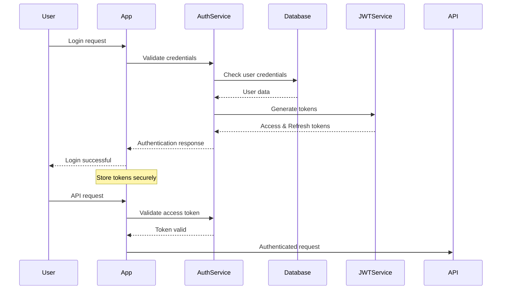

# Backend Architecture

## Service Architecture

### Controller Organization
```
src/
├── routes/
│   ├── auth.ts           # Authentication routes
│   ├── soundboards.ts    # Soundboard CRUD operations
│   ├── audio.ts          # Audio file operations
│   ├── library.ts        # Library browsing and search
│   ├── streaming.ts      # Streaming platform integration
│   ├── ai.ts             # AI processing endpoints
│   └── index.ts          # Route aggregation
├── controllers/
│   ├── AuthController.ts
│   ├── SoundboardController.ts
│   ├── AudioController.ts
│   └── AIController.ts
├── services/
│   ├── AuthService.ts
│   ├── SoundboardService.ts
│   ├── AudioService.ts
│   ├── AIService.ts
│   └── StreamingService.ts
├── models/
│   ├── User.ts
│   ├── Soundboard.ts
│   └── SoundButton.ts
├── middleware/
│   ├── auth.ts
│   ├── validation.ts
│   ├── errorHandler.ts
│   └── rateLimit.ts
└── utils/
    ├── database.ts
    ├── storage.ts
    └── logger.ts
```

### Controller Template
```typescript
// Example controller with proper error handling and validation
import { Request, Response, NextFunction } from 'express';
import { SoundboardService } from '../services/SoundboardService';
import { CreateSoundboardSchema } from '../schemas/soundboard';
import { ApiError } from '../utils/errors';

export class SoundboardController {
  constructor(private soundboardService: SoundboardService) {}

  async getAllSoundboards(req: Request, res: Response, next: NextFunction) {
    try {
      const userId = req.user!.id;
      const soundboards = await this.soundboardService.getUserSoundboards(userId);
      
      res.json({
        success: true,
        data: soundboards,
      });
    } catch (error) {
      next(error);
    }
  }

  async createSoundboard(req: Request, res: Response, next: NextFunction) {
    try {
      const userId = req.user!.id;
      const validatedData = CreateSoundboardSchema.parse(req.body);
      
      const soundboard = await this.soundboardService.createSoundboard({
        ...validatedData,
        userId,
      });
      
      res.status(201).json({
        success: true,
        data: soundboard,
      });
    } catch (error) {
      if (error instanceof ZodError) {
        next(new ApiError('Validation failed', 400, error.errors));
      } else {
        next(error);
      }
    }
  }

  async updateSoundboard(req: Request, res: Response, next: NextFunction) {
    try {
      const { id } = req.params;
      const userId = req.user!.id;
      const updates = req.body;
      
      const soundboard = await this.soundboardService.updateSoundboard(
        id,
        userId,
        updates
      );
      
      if (!soundboard) {
        throw new ApiError('Soundboard not found', 404);
      }
      
      res.json({
        success: true,
        data: soundboard,
      });
    } catch (error) {
      next(error);
    }
  }
}
```

## Database Architecture

### Schema Design
See the detailed SQLite schema in the Database Schema section above.

### Data Access Layer
```typescript
// Repository pattern for data access
import { Database } from 'sqlite3';
import { Soundboard, CreateSoundboardData } from '../types/soundboard';

export class SoundboardRepository {
  constructor(private db: Database) {}

  async findByUserId(userId: string): Promise<Soundboard[]> {
    return new Promise((resolve, reject) => {
      const query = `
        SELECT s.*, 
               json_group_array(
                 json_object(
                   'id', b.id,
                   'label', b.label,
                   'audioPath', b.audio_path,
                   'positionRow', b.position_row,
                   'positionCol', b.position_col
                 )
               ) as buttons
        FROM soundboards s
        LEFT JOIN sound_buttons b ON s.id = b.soundboard_id
        WHERE s.user_id = ?
        GROUP BY s.id
        ORDER BY s.created_at DESC
      `;
      
      this.db.all(query, [userId], (err, rows) => {
        if (err) reject(err);
        else {
          const soundboards = rows.map(row => ({
            ...row,
            buttons: JSON.parse(row.buttons).filter(b => b.id !== null)
          }));
          resolve(soundboards);
        }
      });
    });
  }

  async create(data: CreateSoundboardData): Promise<Soundboard> {
    return new Promise((resolve, reject) => {
      const query = `
        INSERT INTO soundboards (id, user_id, name, description, grid_rows, grid_cols, theme_color)
        VALUES (?, ?, ?, ?, ?, ?, ?)
      `;
      
      const id = this.generateId();
      this.db.run(query, [
        id, data.userId, data.name, data.description,
        data.gridRows, data.gridCols, data.themeColor
      ], function(err) {
        if (err) reject(err);
        else resolve({ id, ...data, buttons: [] });
      });
    });
  }

  async update(id: string, userId: string, data: Partial<Soundboard>): Promise<Soundboard | null> {
    return new Promise((resolve, reject) => {
      const fields = Object.keys(data).map(key => `${this.camelToSnake(key)} = ?`).join(', ');
      const values = Object.values(data);
      
      const query = `UPDATE soundboards SET ${fields} WHERE id = ? AND user_id = ?`;
      
      this.db.run(query, [...values, id, userId], function(err) {
        if (err) reject(err);
        else if (this.changes === 0) resolve(null);
        else resolve({ id, ...data } as Soundboard);
      });
    });
  }

  async delete(id: string, userId: string): Promise<void> {
    return new Promise((resolve, reject) => {
      const query = 'DELETE FROM soundboards WHERE id = ? AND user_id = ?';
      
      this.db.run(query, [id, userId], function(err) {
        if (err) reject(err);
        else resolve();
      });
    });
  }

  private generateId(): string {
    return Math.random().toString(36).substring(2) + Date.now().toString(36);
  }

  private camelToSnake(str: string): string {
    return str.replace(/[A-Z]/g, letter => `_${letter.toLowerCase()}`);
  }
}
```

## Authentication and Authorization

### Auth Flow


### Middleware/Guards
```typescript
// Authentication middleware for Express
import { Request, Response, NextFunction } from 'express';
import jwt from 'jsonwebtoken';
import { ApiError } from '../utils/errors';
import { UserService } from '../services/UserService';

interface AuthenticatedRequest extends Request {
  user?: {
    id: string;
    email: string;
    subscription: string;
  };
}

export const authenticateToken = async (
  req: AuthenticatedRequest,
  res: Response,
  next: NextFunction
) => {
  try {
    const authHeader = req.headers.authorization;
    const token = authHeader && authHeader.split(' ')[1];
    
    if (!token) {
      throw new ApiError('Access token required', 401);
    }
    
    const decoded = jwt.verify(token, process.env.JWT_SECRET!) as any;
    const user = await UserService.findById(decoded.userId);
    
    if (!user) {
      throw new ApiError('User not found', 401);
    }
    
    req.user = {
      id: user.id,
      email: user.email,
      subscription: user.subscriptionTier,
    };
    
    next();
  } catch (error) {
    if (error instanceof jwt.JsonWebTokenError) {
      next(new ApiError('Invalid token', 401));
    } else {
      next(error);
    }
  }
};

// Subscription-based authorization
export const requireSubscription = (requiredTier: string) => {
  return (req: AuthenticatedRequest, res: Response, next: NextFunction) => {
    const userTier = req.user?.subscription;
    const tierHierarchy = ['free', 'pro', 'enterprise'];
    
    const userTierIndex = tierHierarchy.indexOf(userTier || 'free');
    const requiredTierIndex = tierHierarchy.indexOf(requiredTier);
    
    if (userTierIndex < requiredTierIndex) {
      throw new ApiError('Subscription upgrade required', 403);
    }
    
    next();
  };
};
```

---
