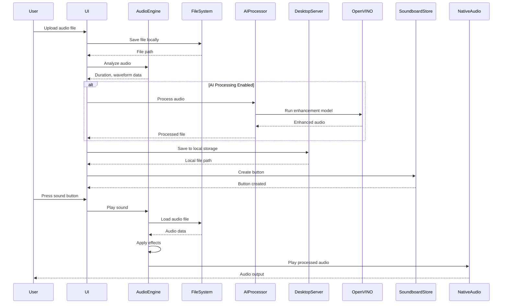
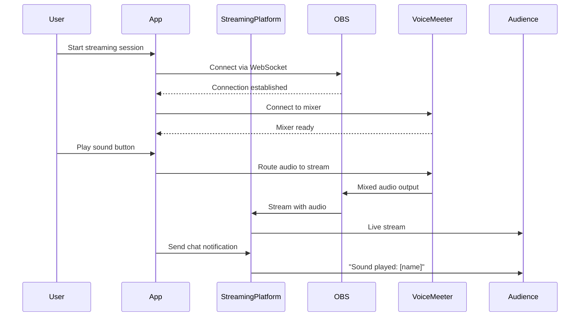
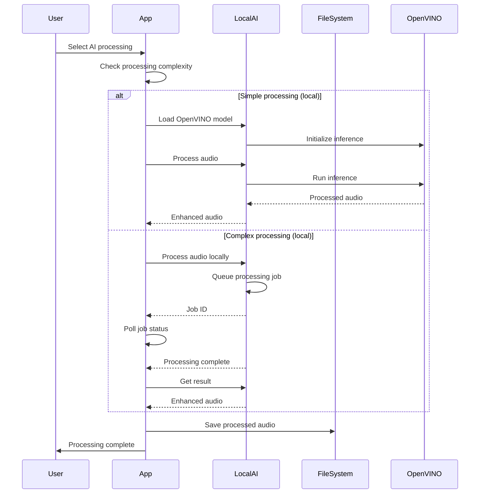

# Core Workflows

## Sound Button Creation and Playback

```mermaid
sequenceDiagram
    participant User
    participant UI
    participant AudioEngine
    participant FileSystem
    participant AIProcessor
    participant DesktopServer

    User->>UI: Upload audio file
    UI->>FileSystem: Save file locally
    FileSystem-->>UI: File path
    UI->>AudioEngine: Analyze audio
    AudioEngine-->>UI: Duration, waveform data
    
    alt AI Processing Enabled
        UI->>AIProcessor: Process audio
        AIProcessor->>OpenVINO: Run enhancement model
        OpenVINO-->>AIProcessor: Enhanced audio
        AIProcessor-->>UI: Processed file
    end
    
    UI->>DesktopServer: Save to local storage
    DesktopServer-->>UI: Local file path
    UI->>SoundboardStore: Create button
    SoundboardStore-->>UI: Button created
    
    User->>UI: Press sound button
    UI->>AudioEngine: Play sound
    AudioEngine->>FileSystem: Load audio file
    FileSystem-->>AudioEngine: Audio data
    AudioEngine->>AudioEngine: Apply effects
    AudioEngine->>NativeAudio: Play processed audio
    NativeAudio-->>User: Audio output
```

## Real-time Streaming Workflow

```mermaid
sequenceDiagram
    participant User
    participant App
    participant StreamingPlatform
    participant OBS
    participant VoiceMeeter
    participant Audience

    User->>App: Start streaming session
    App->>OBS: Connect via WebSocket
    OBS-->>App: Connection established
    App->>VoiceMeeter: Connect to mixer
    VoiceMeeter-->>App: Mixer ready
    
    User->>App: Play sound button
    App->>VoiceMeeter: Route audio to stream
    VoiceMeeter->>OBS: Mixed audio output
    OBS->>StreamingPlatform: Stream with audio
    StreamingPlatform->>Audience: Live stream
    
    App->>StreamingPlatform: Send chat notification
    StreamingPlatform->>Audience: "Sound played: [name]"
```

## AI Audio Processing Workflow

```mermaid
sequenceDiagram
    participant User
    participant App
    participant LocalAI
    participant LocalAI
    participant FileSystem

    User->>App: Select AI processing
    App->>App: Check processing complexity
    
    alt Simple processing (local)
        App->>LocalAI: Load OpenVINO model
        LocalAI->>OpenVINO: Initialize inference
        App->>LocalAI: Process audio
        LocalAI->>OpenVINO: Run inference
        OpenVINO-->>LocalAI: Processed audio
        LocalAI-->>App: Enhanced audio
    else Complex processing (local)
        App->>LocalAI: Process audio locally
        LocalAI->>LocalAI: Queue processing job
        LocalAI-->>App: Job ID
        App->>App: Poll job status
        LocalAI-->>App: Processing complete
        App->>LocalAI: Get result
        LocalAI-->>App: Enhanced audio
    end
    
    App->>FileSystem: Save processed audio
    App->>User: Processing complete
```

---
