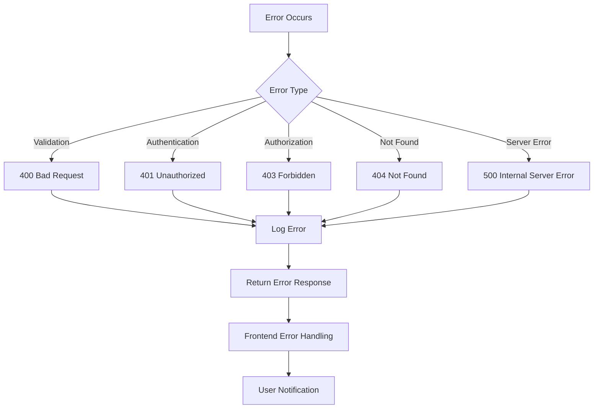

# Error Handling

## Error Flow



## Error Response Format

```typescript
// Standardized error response
interface ApiErrorResponse {
  success: false;
  error: {
    code: string;
    message: string;
    details?: any;
    timestamp: string;
    requestId: string;
  };
}

// Example error responses
const validationError: ApiErrorResponse = {
  success: false,
  error: {
    code: 'VALIDATION_ERROR',
    message: 'Invalid input data',
    details: {
      field: 'email',
      reason: 'Invalid email format'
    },
    timestamp: '2024-01-15T10:30:00Z',
    requestId: 'req_123456789'
  }
};

const serverError: ApiErrorResponse = {
  success: false,
  error: {
    code: 'INTERNAL_SERVER_ERROR',
    message: 'An unexpected error occurred',
    timestamp: '2024-01-15T10:30:00Z',
    requestId: 'req_123456789'
  }
};
```

## Frontend Error Handling

```typescript
// Error boundary for React Native
class ErrorBoundary extends React.Component<
  { children: React.ReactNode },
  { hasError: boolean; error?: Error }
> {
  constructor(props: any) {
    super(props);
    this.state = { hasError: false };
  }
  
  static getDerivedStateFromError(error: Error) {
    return { hasError: true, error };
  }
  
  componentDidCatch(error: Error, errorInfo: React.ErrorInfo) {
    logger.error('React Error Boundary caught an error:', {
      error: error.message,
      stack: error.stack,
      errorInfo,
    });
    
    // Report to crash analytics
    crashlytics().recordError(error);
  }
  
  render() {
    if (this.state.hasError) {
      return (
        <ErrorScreen
          error={this.state.error}
          onRetry={() => this.setState({ hasError: false })}
        />
      );
    }
    
    return this.props.children;
  }
}

// API error handling hook
const useApiError = () => {
  const showToast = useToast();
  
  const handleApiError = useCallback((error: ApiError) => {
    switch (error.code) {
      case 'NETWORK_ERROR':
        showToast({
          type: 'error',
          title: 'Connection Error',
          message: 'Please check your internet connection',
        });
        break;
        
      case 'VALIDATION_ERROR':
        showToast({
          type: 'warning',
          title: 'Invalid Input',
          message: error.message,
        });
        break;
        
      case 'UNAUTHORIZED':
        // Redirect to login
        NavigationService.navigate('Login');
        break;
        
      default:
        showToast({
          type: 'error',
          title: 'Something went wrong',
          message: 'Please try again later',
        });
    }
  }, [showToast]);
  
  return { handleApiError };
};
```

## Backend Error Handling

```typescript
// Custom error classes
class ApiError extends Error {
  constructor(
    public message: string,
    public statusCode: number = 500,
    public code: string = 'INTERNAL_SERVER_ERROR',
    public details?: any
  ) {
    super(message);
    this.name = 'ApiError';
  }
}

class ValidationError extends ApiError {
  constructor(message: string, details?: any) {
    super(message, 400, 'VALIDATION_ERROR', details);
  }
}

class NotFoundError extends ApiError {
  constructor(resource: string) {
    super(`${resource} not found`, 404, 'NOT_FOUND');
  }
}

// Global error handler middleware
const errorHandler = (
  error: Error,
  req: Request,
  res: Response,
  next: NextFunction
) => {
  const requestId = req.headers['x-request-id'] as string;
  
  // Log error
  logger.error('API Error:', {
    error: error.message,
    stack: error.stack,
    requestId,
    url: req.url,
    method: req.method,
    userId: req.user?.id,
  });
  
  // Handle known errors
  if (error instanceof ApiError) {
    return res.status(error.statusCode).json({
      success: false,
      error: {
        code: error.code,
        message: error.message,
        details: error.details,
        timestamp: new Date().toISOString(),
        requestId,
      },
    });
  }
  
  // Handle unknown errors
  res.status(500).json({
    success: false,
    error: {
      code: 'INTERNAL_SERVER_ERROR',
      message: 'An unexpected error occurred',
      timestamp: new Date().toISOString(),
      requestId,
    },
  });
};
```

---
